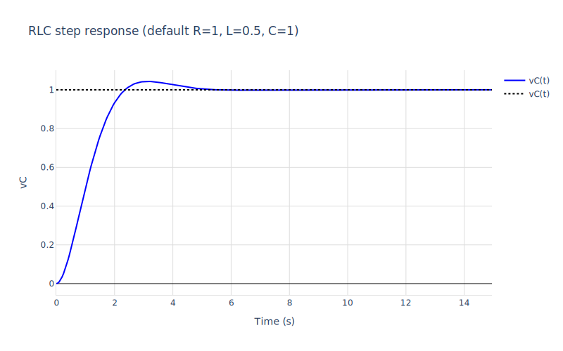
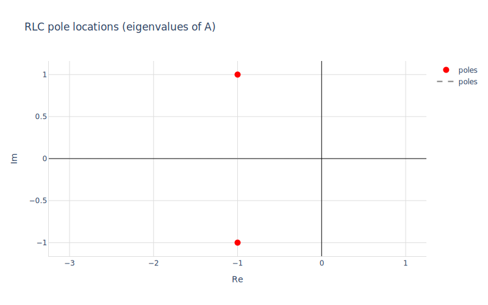
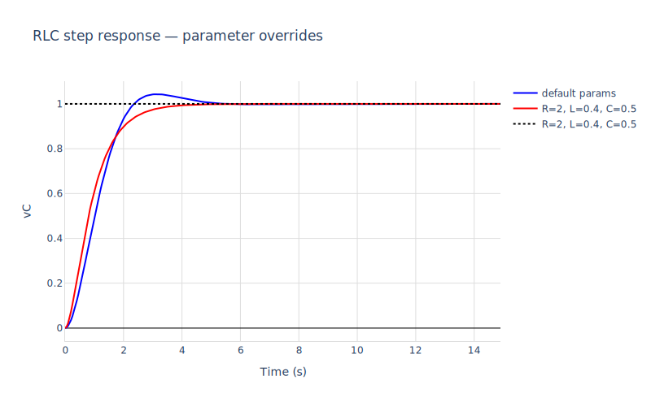
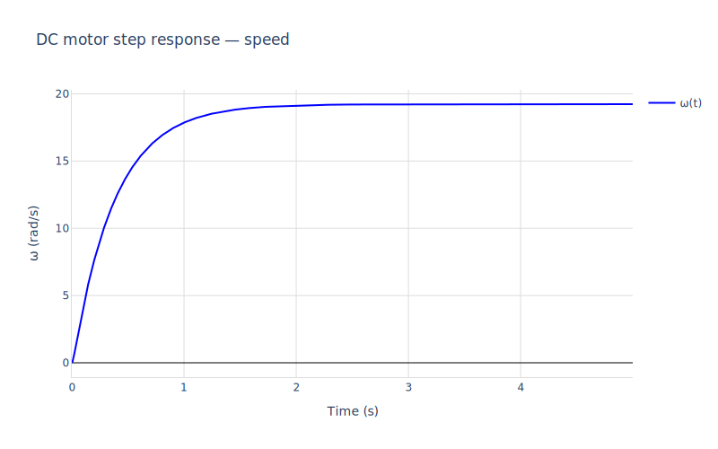
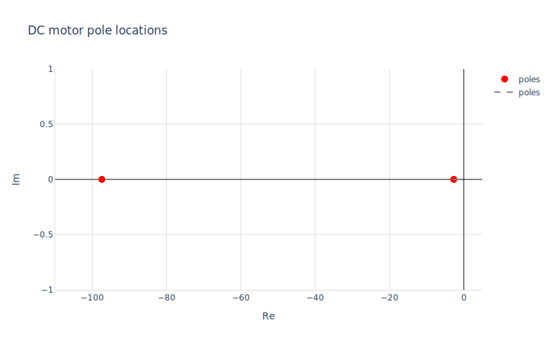
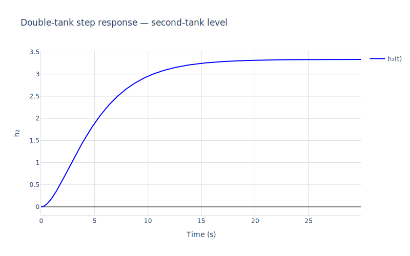
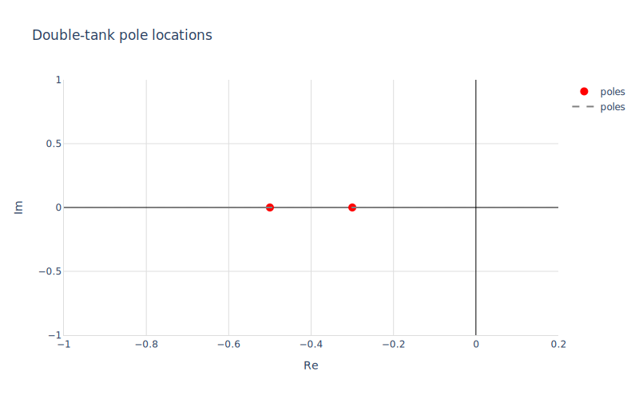
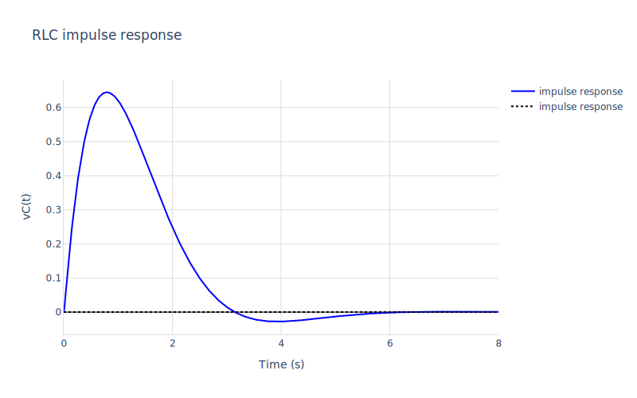

# 01 — Linear analysis with mochi

This notebook walks through the bread-and-butter linear-control workflow on a few single-block plants:

1. **RLCircuit** — load, linearise, step/impulse, transfer function.
2. **DCMotor** — fast/slow eigenvalues; pole-zero map.
3. **DoubleTank** — cascaded states.
4. **Symbolic state-space + composition** — `mod_state_space_symbolic`, `mod_transfer_function`, and `mod_cascade` to wire two RLCs into a 4-state composite.

Everything here uses the linearisation around an operating point. For nonlinear simulation see `03_nonlinear.macnb`.


```maxima
/* Load the package and helpers. */
load("../../mochi.mac")$
load("numerics")$
load("ax-plots")$

/* Pole locations (eigenvalues of A) — used in scatter plots below. */
poles_of(A_) := block([evals, _, lst],
  [evals, _] : np_eig(ndarray(float(A_))),
  lst : np_to_list(evals),
  [map(realpart, lst), map(imagpart, lst)])$

```

## 1. RLC circuit

A series RLC driven by a voltage source. States: inductor current $i_L$, capacitor voltage $v_C$.
Output: capacitor voltage.


```maxima
m_rlc : mod_load("../RLCircuit.mo")$
mod_print(m_rlc)$
```

    Model:  RLCircuit
      parameters:  [[R,1.0],[L,0.5],[Ccap,1.0]]
      states:      [iL,vC]
      derivs:      [der_iL,der_vC]
      inputs:      [Vin]
      outputs:     [y]
      initial:     [[iL,0],[vC,0]]
      residuals:
         vC+R*iL+L*der_iL-Vin  = 0
         Ccap*der_vC-iL  = 0
         y-vC  = 0

Linearise at the equilibrium $i_L = v_C = V_{in} = 0$:


```maxima
[A, B, C, D] : mod_state_space(m_rlc, [iL = 0, vC = 0, Vin = 0])$
print("A =")$ A;
print("B =")$ B;
print("C =")$ C;
print("D =")$ D;
```

    A =
    matrix([-2.0,-2.0],[1.0,0.0])
    B =
    matrix([2.0],[0.0])
    C =
    matrix([0.0,1.0])
    D =


```math
\begin{pmatrix} 0.0\end{pmatrix} 
```


### Step response


```maxima
[t_sim, y_rlc] : mod_step(m_rlc, [iL = 0, vC = 0, Vin = 0], 14.95,
                          ['dt = 0.05])$

ax_draw2d(
  color="blue", line_width=2, name="vC(t)",
  lines(t_sim, y_rlc),
  color="black", dash="dot", explicit(1, t, 0, last(t_sim)),
  title="RLC step response (default R=1, L=0.5, C=1)",
  xlabel="Time (s)", ylabel="vC",
  grid=true, showlegend=true
)$
```


    

    


### Closed-loop poles


```maxima
[re_p, im_p] : poles_of(A)$
ax_draw2d(
  marker_size=10, color="red", name="poles",
  points(re_p, im_p),
  color="gray", dash="dash", explicit(0, t, -3, 1),
  title="RLC pole locations (eigenvalues of A)",
  xlabel="Re", ylabel="Im",
  grid=true, aspect_ratio=true, showlegend=true
)$
```


    

    


### Override parameters

A different physical motor with $R=2, L=0.4, C=0.5$:


```maxima
[A2, B2, C2, D2] : mod_state_space(m_rlc,
                                          [iL = 0, vC = 0, Vin = 0],
                                          [R = 2, L = 0.4, Ccap = 0.5])$
print("A =")$ A2;

[_, y_rlc2] : mod_step(m_rlc, [iL = 0, vC = 0, Vin = 0], 14.95,
                       ['dt = 0.05,
                        'params = [R = 2, L = 0.4, Ccap = 0.5]])$

ax_draw2d(
  color="blue", line_width=2, name="default params",
  lines(t_sim, y_rlc),
  color="red", line_width=2, name="R=2, L=0.4, C=0.5",
  lines(t_sim, y_rlc2),
  color="black", dash="dot", explicit(1, t, 0, last(t_sim)),
  title="RLC step response — parameter overrides",
  xlabel="Time (s)", ylabel="vC",
  grid=true, showlegend=true
)$
```

    A =
    matrix([-5.0,-2.5],[2.0,0.0])


    

    


## 2. DC motor

Armature current $i_a$, angular speed $\omega$. Input: armature voltage $v_a$. Output: speed.


```maxima
m_motor : mod_load("../DCMotor.mo")$
mod_print(m_motor)$
```

    Model:  DCMotor
      parameters:  [[Ra,1.0],[La,0.01],[Kt,0.05],[Ke,0.05],[Jm,0.001],[Bv,1.0e-4]]
      states:      [ia,omega]
      derivs:      [der_ia,der_omega]
      inputs:      [va]
      outputs:     [y]
      initial:     [[ia,0],[omega,0]]
      residuals:
         -va+Ke*omega+Ra*ia+La*der_ia  = 0
         Bv*omega-Kt*ia+Jm*der_omega  = 0
         y-omega  = 0


```maxima
[Am, Bm, Cm, Dm] : mod_state_space(m_motor, [ia = 0, omega = 0, va = 0])$
print("DC motor A =")$ Am;
print("DC motor B =")$ Bm;
```

    DC motor A =
    matrix([-100.0,-5.0],[50.0,-0.1])
    DC motor B =


```math
\begin{pmatrix} 100.0\\ 0.0\end{pmatrix} 
```


The DC motor has one fast pole (electrical, $\sim -100$ rad/s) and one slow pole
(mechanical) — the response shows both timescales.


```maxima
[t_sim_m, y_motor] : mod_step(m_motor, [ia = 0, omega = 0, va = 0], 4.999,
                                 ['dt = 0.001])$

ax_draw2d(
  color="blue", line_width=2, name="ω(t)",
  lines(t_sim_m, y_motor),
  title="DC motor step response — speed",
  xlabel="Time (s)", ylabel="ω (rad/s)",
  grid=true, showlegend=true
)$
```


    

    


```maxima
[re_m, im_m] : poles_of(Am)$
ax_draw2d(
  marker_size=10, color="red", name="poles",
  points(re_m, im_m),
  color="gray", dash="dash", explicit(0, t, -110, 5),
  title="DC motor pole locations",
  xlabel="Re", ylabel="Im",
  grid=true, showlegend=true
)$
```


    

    


## 3. Double tank cascade

Two tanks, gravity flow with linear outlet coefficients.


```maxima
m_tank : mod_load("../DoubleTank.mo")$
mod_print(m_tank)$
```

    Model:  DoubleTank
      parameters:  [[A1,1.0],[A2,1.0],[k1,0.5],[k2,0.3]]
      states:      [h1,h2]
      derivs:      [der_h1,der_h2]
      inputs:      [q_in]
      outputs:     [y]
      initial:     [[h1,0],[h2,0]]
      residuals:
         -q_in+h1*k1+A1*der_h1  = 0
         h2*k2-h1*k1+A2*der_h2  = 0
         y-h2  = 0


```maxima
[At, Bt, Ct, Dt] : mod_state_space(m_tank, [h1 = 0, h2 = 0, q_in = 0])$
print("Double-tank A =")$ At;
```

    Double-tank A =


```math
\begin{pmatrix} -0.5&0.0\\ 0.5&-0.3\end{pmatrix} 
```


```maxima
[t_sim_t, y_tank] : mod_step(m_tank, [h1 = 0, h2 = 0, q_in = 0], 29.9,
                                ['dt = 0.1])$

ax_draw2d(
  color="blue", line_width=2, name="h₂(t)",
  lines(t_sim_t, y_tank),
  title="Double-tank step response — second-tank level",
  xlabel="Time (s)", ylabel="h₂",
  grid=true, showlegend=true
)$
```


    

    


```maxima
[re_t, im_t] : poles_of(At)$
ax_draw2d(
  marker_size=10, color="red", name="poles",
  points(re_t, im_t),
  color="gray", dash="dash", explicit(0, t, -1, 0.2),
  title="Double-tank pole locations",
  xlabel="Re", ylabel="Im",
  grid=true, showlegend=true
)$
```


    

    


## 4. New API: symbolic SS, transfer function, interconnection

The package also exposes:

- `mod_state_space_symbolic(m, op)` — A, B, C, D with parameters left as symbols.
- `mod_transfer_function(m, op)` — H(s) = C(sI − A)⁻¹B + D.
- `mod_cascade(SS1, SS2)` / `mod_parallel(SS1, SS2)` / `mod_unity_feedback(SS, K)` — block-stack two state-space tuples.
- `mod_simulate(m, op, u_fn, t_end)` — generic input-driven simulation; `mod_step`, `mod_impulse` are wrappers.


```maxima
/* Symbolic state-space — useful for inspecting structure */
[As, Bs, Cs, Ds] : mod_state_space_symbolic(m_rlc, [iL = 0, vC = 0, Vin = 0])$
print("Symbolic A:")$ As;
print("Symbolic B:")$ Bs;
```

    Symbolic A:
    matrix([-(R/L),-(1/L)],[1/Ccap,0])
    Symbolic B:


```math
\begin{pmatrix} {{1}\over{L}}\\ 0\end{pmatrix} 
```


```maxima
/* Transfer function */
H_rlc : mod_transfer_function(m_rlc, [iL = 0, vC = 0, Vin = 0])$
print("H(s) =")$ H_rlc;
print("(closed form: 1 / (LCs² + RCs + 1) = 1 / (0.5 s² + s + 1))")$
```

    rat: replaced 2.0 by 2/1 = 2.0
    rat: replaced 2.0 by 2/1 = 2.0
    rat: replaced 2.0 by 2/1 = 2.0
    H(s) =
    matrix([2/(s^2+2*s+2)])
    (closed form: 1 / (LCs² + RCs + 1) = 1 / (0.5 s² + s + 1))


```maxima
/* Cascade two RLCs and plot the impulse response of the 4-state composite */
SS_rlc : mod_state_space(m_rlc, [iL = 0, vC = 0, Vin = 0])$
[Ac, Bc, Cc, Dc] : mod_cascade(SS_rlc, SS_rlc)$
print("Cascade A is", length(Ac), "x", length(Ac), "(2+2 states):")$
Ac;
```

    Cascade A is 4 x 4 (2+2 states):


```math
\begin{pmatrix} -2.0&-2.0&0&0\\1.0&0.0&0&0\\ 0.0&2.0&-2.0&-2.0\\ 0.0&0.0&1.0&0.0\end{pmatrix} 
```


```maxima
/* Impulse response of the RLC */
[t_imp, y_imp] : mod_impulse(m_rlc, [iL = 0, vC = 0, Vin = 0], 8.0)$
ax_draw2d(
  color="blue", line_width=2, name="impulse response",
  lines(t_imp, y_imp),
  color="black", dash="dot", explicit(0, t, 0, last(t_imp)),
  title="RLC impulse response",
  xlabel="Time (s)", ylabel="vC(t)",
  grid=true, showlegend=true
)$
```


    

    

