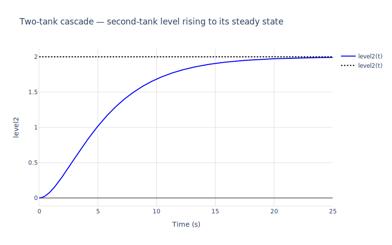
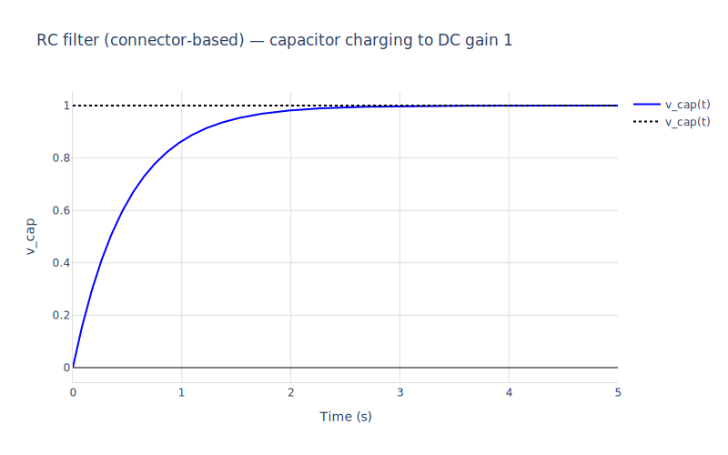
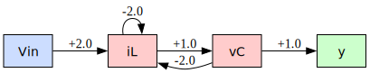
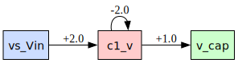

# 02 — Multi-component models

How to compose a system out of multiple Modelica components — by direct equations between instances, or with proper Modelica `connect()` syntax over connector classes — and how to visualise the resulting dataflow inline.

Sections:

1. **TwoTanks** — equation-composed: two `Tank` instances wired by `tank1.q_in = source`.
2. **RCFilter** — connector-composed: `connect(a.port, b.port)` with flow/potential semantics.
3. **Dataflow diagrams** — `mod_diagram` renders the linearised graph as inline SVG.


```maxima
/* Load the package and helpers. */
load("../../mochi.mac")$
load("numerics")$
load("ax-plots")$

/* Pole locations (eigenvalues of A) — used in scatter plots below. */
poles_of(A_) := block([evals, _, lst],
  [evals, _] : np_eig(ndarray(float(A_))),
  lst : np_to_list(evals),
  [map(realpart, lst), map(imagpart, lst)])$

```

## 5. Connected plants in a single `.mo` file

mochi can also handle Modelica files where the top-level model is built by *composing*
component instances — rumoca flattens the hierarchy, and mochi translates dotted names
like `tank1.h` to Maxima-safe `tank1_h`. Connector-internal variables (e.g. each Tank's
`q_in`/`q_out`) are auto-classified as algebraic and solved away.


```maxima
m_tt : mod_load("../TwoTanks.mo")$
mod_print(m_tt)$
```

    Model:  TwoTanks
      parameters:  [[tank1_A,1.0],[tank1_k,0.5],[tank2_A,2.0],[tank2_k,0.5]]
      states:      [tank1_h,tank2_h]
      derivs:      [der_tank1_h,der_tank2_h]
      inputs:      [source]
      outputs:     [level2]
      initial:     [[tank1_h,0],[tank2_h,0]]
      residuals:
         -tank1_q_in+tank1_h*tank1_k+der_tank1_h*tank1_A  = 0
         tank1_q_out-tank1_h*tank1_k  = 0
         -tank2_q_in+tank2_h*tank2_k+der_tank2_h*tank2_A  = 0
         tank2_q_out-tank2_h*tank2_k  = 0
         tank1_q_in-source  = 0
         tank2_q_in-tank1_q_out  = 0
         level2-tank2_h  = 0


```maxima
[Att, Btt, Ctt, Dtt] : mod_state_space(m_tt, [tank1_h = 0, tank2_h = 0, source = 0])$
print("TwoTanks A:")$ Att;
print("TwoTanks B:")$ Btt;
print("TwoTanks C:")$ Ctt;
```

    TwoTanks A:
    matrix([-0.5,0.0],[0.25,-0.25])
    TwoTanks B:
    matrix([1.0],[0.0])
    TwoTanks C:


$$ \begin{pmatrix} 0.0&1.0\end{pmatrix}  $$


```maxima
[t_tt, y_tt] : mod_step(m_tt, [tank1_h = 0, tank2_h = 0, source = 0], 25.0)$
ax_draw2d(
  color="blue", line_width=2, name="level2(t)",
  lines(t_tt, y_tt),
  color="black", dash="dot", explicit(2, t, 0, last(t_tt)),
  title="Two-tank cascade — second-tank level rising to its steady state",
  xlabel="Time (s)", ylabel="level2",
  grid=true, showlegend=true
)$
```


    

    


## 6. Modelica `connect()` syntax — RC low-pass filter

Real component-based modelling: each part exposes a connector port (here an `ElectricalPin`
with potential `v` and flow `i`), and `connect(...)` statements wire instances together. rumoca
expands each connect into Kirchhoff-style equations (potentials equate, flows sum to zero) before
mochi sees the JSON.


```maxima
m_rc : mod_load("../RCFilter.mo")$
mod_print(m_rc)$
```

    Model:  RCFilter
      parameters:  [[r1_R,1.0],[c1_C,0.5]]
      states:      [c1_v]
      derivs:      [der_c1_v]
      inputs:      [vs_Vin]
      outputs:     [v_cap]
      initial:     [[c1_v,0]]
      residuals:
         r1_p_i+r1_n_i  = 0
         r1_p_v-r1_R*r1_p_i-r1_n_v  = 0
         c1_v-c1_p_v+c1_n_v  = 0
         c1_p_i+c1_n_i  = 0
         c1_C*der_c1_v-c1_p_i  = 0
         vs_p_v-vs_n_v-vs_Vin  = 0
         vs_p_i+vs_n_i  = 0
         gnd_p_v  = 0
         v_cap-c1_v  = 0
         vs_p_i+r1_p_i  = 0
         r1_n_i+c1_p_i  = 0
         vs_n_i+gnd_p_i+c1_n_i  = 0
         vs_p_v-r1_p_v  = 0
         r1_n_v-c1_p_v  = 0
         c1_n_v-gnd_p_v  = 0
         gnd_p_v-vs_n_v  = 0


```maxima
[A_rc, B_rc, C_rc, D_rc] : mod_state_space(m_rc, [c1_v = 0, vs_Vin = 0])$
print("RC filter A:")$ A_rc;
print("RC filter B:")$ B_rc;
print("RC filter C:")$ C_rc;
```

    RC filter A:
    matrix([-2.0])
    RC filter B:
    matrix([2.0])
    RC filter C:


$$ \begin{pmatrix} 1.0\end{pmatrix}  $$


```maxima
[t_rc, y_rc] : mod_step(m_rc, [c1_v = 0, vs_Vin = 0], 5.0)$
ax_draw2d(
  color="blue", line_width=2, name="v_cap(t)",
  lines(t_rc, y_rc),
  color="black", dash="dot", explicit(1, t, 0, last(t_rc)),
  title="RC filter (connector-based) — capacitor charging to DC gain 1",
  xlabel="Time (s)", ylabel="v_cap",
  grid=true, showlegend=true
)$
```


    

    


## 7. Dataflow diagrams

`mod_diagram(m, op)` builds the linearised dataflow graph and renders an SVG inline. Inputs (blue) on the left, states (red) in the middle with self-loops for diagonal A entries, outputs (green) on the right.

**The numbers on the edges are entries of the linearised state-space matrices.** Concretely:

- `state[j] → state[i]` is `A[i,j]` — how much state *j* contributes to **dx_i/dt** per unit of *j*
- `input[j] → state[i]` is `B[i,j]` — how much input *j* contributes to **dx_i/dt** per unit of *j*
- `state[j] → output[k]` is `C[k,j]` — how much state *j* contributes to output *k*
- `input[j] → output[k]` is `D[k,j]` — direct feedthrough

For the RLC plant below (with default R=1, L=½, C=1) you can read the linearised ODE straight off the diagram:

$$\frac{di_L}{dt} = -2\,i_L \;-\; 2\,v_C \;+\; 2\,V_{in}, \qquad \frac{dv_C}{dt} = +1\,i_L, \qquad y = +1\,v_C.$$

(That's exactly $L\dot i_L + R i_L + v_C = V_{in}$ and $C\dot v_C = i_L$ rearranged into $\dot x = Ax + Bu$, $y = Cx$ form.)

The `'renderer` option picks the engine: `'dot` (GraphViz, default) or `'mermaid` (Mermaid CLI). For raw text output use `mod_to_dot`, `mod_to_mermaid`, or `mod_dataflow(m, op, ['format = 'edges])` for the raw `[from, to, weight]` list.


```maxima
mod_diagram(m_rlc, [iL = 0, vC = 0, Vin = 0])$
```


    

    


Same idea for the connector-composed RCFilter — rumoca expanded the `connect()` statements into Kirchhoff equations, leaving a single state `c1_v` (capacitor voltage), the VoltageSource's `vs_Vin` as input, and `v_cap` as output.

Reading the edges (default R=1, C=½):

- `c1_v → c1_v : −2.0` is $A = -\tfrac{1}{RC} = -2$
- `vs_Vin → c1_v : +2.0` is $B = \tfrac{1}{RC} = +2$
- `c1_v → v_cap : +1.0` is $C = 1$ (the output is just the capacitor voltage)

i.e. the standard RC low-pass $\dot v_C = -\tfrac{1}{RC}\, v_C + \tfrac{1}{RC}\, V_{in}$ that we step-tested in section 6.


```maxima
mod_diagram(m_rc, [c1_v = 0, vs_Vin = 0])$
```


    

    

