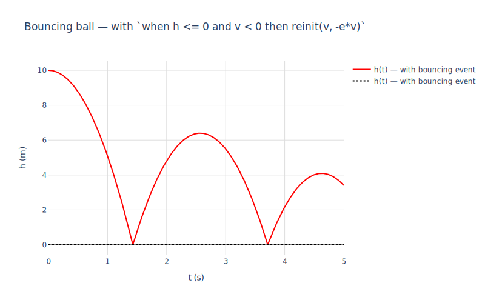

# 04 — Discrete events (bouncing ball)

The previous notebook (`03_nonlinear.macnb`) integrated **continuous** nonlinear dynamics — `sin(theta)` gravity, viscous damping, sinusoidal forcing. But many real systems also have **discrete events**: instants where the state of the world changes discontinuously. Classic examples:

- A ball hitting the floor and reversing velocity (this notebook).
- A diode switching on or off.
- A relay flipping when a signal crosses a threshold.
- A gear shifting in a transmission.

Modelica expresses these with `when (condition) then ... reinit(state, new_value) end when;`. rumoca surfaces the condition as a separate `f_c` block in its JSON, and the reset rule as an `f_z` discrete equation. mochi-nonlinear's `mod_simulate_nonlinear` accepts these via the `'events` opt: each entry is a `[event_expr, reset_eqs]` pair. SUNDIALS CVODE detects zero crossings of `event_expr` (its rootfinder), and the loop applies `reset_eqs` to compute the post-event state and restart integration.


```maxima
load("../../mochi.mac")$
load("numerics")$
load("numerics-sundials")$
load("../../mochi-nonlinear.mac")$
load("ax-plots")$
```

## 1. The Bouncing Ball model

```modelica
model BouncingBall
  parameter Real e = 0.8;        // coefficient of restitution
  parameter Real g = 9.81;
  Real h(start = 10);            // height above ground
  Real v(start = 0);             // upward velocity
equation
  der(h) = v;
  der(v) = -g;
  when h <= 0 and v < 0 then
    reinit(v, -e * pre(v));
  end when;
end BouncingBall;
```

Two states ($h$, $v$), no inputs, no explicit output. Continuous dynamics: free-fall under gravity ($\dot v = -g$, $\dot h = v$). Discrete event: when the ball hits the floor (`h ≤ 0`) while moving downward (`v < 0`), velocity reverses and is multiplied by the coefficient of restitution $e$.


```maxima
m : mod_load("../BouncingBall.mo")$
mod_print(m)$
```

    Model:  BouncingBall
      parameters:  [[e,0.8],[g,9.81]]
      states:      [h,v]
      derivs:      [der_h,der_v]
      inputs:      []
      outputs:     []
      initial:     [[h,10],[v,0]]
      residuals:
         der_h-v  = 0
         g+der_v  = 0
      events:
        when  h <= 0 and v < 0 :  [v = -(e*v)]

Notice the residuals are continuous-only — `der_h - v = 0` and `g + der_v = 0`. The `when` clause is *not* in the residual list; it lives in rumoca's discrete `f_z` block, which mochi exposes through the `'events` opt of `mod_simulate_nonlinear` rather than through the continuous DAE.

## 2. Continuous dataflow

Here's the linearised dataflow diagram for the **continuous** part of the model — i.e. the free-fall dynamics without the bounce. With no input and no output, the diagram just shows how the two states feed into each other's derivatives:


```maxima
mod_diagram(m, [h = 1, v = 0])$
```


    

    


$v$ feeds `der_h` (the kinematic relation $\dot h = v$), and the constant $-g$ contributes to `der_v` — but since `-g` is a parameter and not a state, it doesn't appear as an edge. The diagram captures only the linear *state-to-state* coupling. The discrete event (the bounce) is invisible in this view: it's a step that happens between integrator calls, not a continuous edge.

## 3. Without events: ball falls through the floor

To start, simulate without the event handling — just continuous free fall. The ball passes through `h = 0` and keeps accelerating downward.


```maxima
[t_no_event, x_no_event] :
  mod_simulate_nonlinear(m, [10.0, 0.0],
                         lambda([t], []),
                         5.0,
                         ['return = 'states,
                          'events = []])$  /* opt out — ignore the when clause */

ax_draw2d(
  color="gray", line_width=2, name="h(t) — no events",
  lines(t_no_event, map(first, x_no_event)),
  color="black", dash="dot", explicit(0, t, 0, 5),
  title="Bouncing ball, no event handling",
  xlabel="t (s)", ylabel="h (m)",
  yrange=[-115, 15],
  grid=true, showlegend=true
)$
```


    

    


By $t=5$ the ball is more than 100 m below ground — physically meaningless without the floor's contact constraint.

## 4. With events: the ball bounces

By default, `mod_simulate_nonlinear` uses the events auto-extracted from the model's `when` clause — see the `events:` line printed by `mod_print` above. The single `when h <= 0 and v < 0 then reinit(v, -e * pre(v)) end when;` declaration in `BouncingBall.mo` becomes:

- A list of **detector** expressions (one per primitive comparison: `h` for `h <= 0`, `v` for `v < 0`) that CVODE's rootfinder watches.
- A **reset** rule `[v = -e * v]` (the `pre(v)` was simplified — at event time `pre(v) = v`).
- A **guard** `min(-h, -v)` that's positive iff the original conjunction `h <= 0 AND v < 0` holds.

When CVODE detects a zero crossing of any detector, the loop evaluates the guard at the event-time state. If `guard > 0`, the reset fires and integration restarts. If `guard <= 0`, the detection is treated as spurious (e.g. the post-bounce state is at $h = 0$ but with $v > 0$, so `v < 0` fails — no second reset). This is exactly what the user's compound `when` clause meant.

To call `mod_simulate_nonlinear` with auto-extracted events, just don't pass the `'events` opt:


```maxima
[t_evt, x_evt] :
  mod_simulate_nonlinear(m, [10.0, 0.0],
                         lambda([t], []),
                         5.0,
                         ['return = 'states])$
/* No 'events arg — mod_simulate_nonlinear uses the events
   auto-extracted from the model's `when' clause (see mod_print). */

ax_draw2d(
  color="red", line_width=2, name="h(t) — with bouncing event",
  lines(t_evt, map(first, x_evt)),
  color="black", dash="dot", explicit(0, t, 0, 5),
  title="Bouncing ball — with `when h <= 0 and v < 0 then reinit(v, -e*v)`",
  xlabel="t (s)", ylabel="h (m)",
  grid=true, showlegend=true
)$
```

    rat: replaced 9.020562075079397e-17 by 1/11085783698142760 = 9.020562075079397e-17
    rat: replaced -6.399996810006506 by -38119181/5956125 = -6.399996810006506
    rat: replaced 4.615891002757166e-13 by 11/23830718692078 = 4.615891002757172e-13
    rat: replaced -4.09599615995965 by -335364695/81876223 = -4.09599615995965


    

    


Each cusp is a bounce: the ball decelerates as it falls, reverses direction at the floor (with $80\%$ of its incoming speed because $e = 0.8$), rises to a lower peak, and comes back down. The bounces become arbitrarily close in time — Zeno-like behaviour — but `mod_simulate_nonlinear` has a watchdog (max 100 events per segment) that breaks the loop before it explodes numerically.

## 5. Phase portrait

Plotting velocity vs height makes the bounces unmistakable: each bounce is a **vertical jump** in the $v$ direction at the $h = 0$ axis (continuous dynamics → smooth curve, discrete reset → straight vertical edge).


```maxima
ax_draw2d(
  color="red", line_width=2, name="trajectory",
  lines(map(first, x_evt), map(second, x_evt)),
  marker_size=10, color="green", name="start (h=10, v=0)",
  points([first(x_evt)[1]], [first(x_evt)[2]]),
  color="black", dash="dot", name="floor",
  explicit(v, v, -15, 15),
  title="Bouncing ball phase portrait — h vs v",
  xlabel="h (m)", ylabel="v (m/s)",
  xrange=[-1, 11], yrange=[-15, 15],
  grid=true, showlegend=true
)$
```


    

    


The phase trajectory spirals inward: each bounce loses 36% of the kinetic energy ($1 - e^2 = 1 - 0.64 = 0.36$), so the velocity at successive ground hits decays geometrically. The vertical jumps along the $h = 0$ line are the event resets — the only place the trajectory isn't smooth.

## What we got

mochi auto-extracts `when` clauses from rumoca's `f_z` block straight into the model struct's `events` field, so writing the event handling in the .mo file is enough — `mod_simulate_nonlinear` picks it up by default. `mod_print` shows what was extracted.

Internally each event tuple is `[detector, reset_eqs, guard, cond_pretty, direction]`:

- **Detector** — a real-valued expression whose zero crossings CVODE's rootfinder watches.
- **Reset** — the list of state-reset equations (with `pre(...)` simplified — at event time `pre(v) = v` since CVODE returns the pre-event state).
- **Guard** — a real-valued expression that's positive iff the original Modelica boolean condition is true. Compound conditions with `and`/`or` are translated faithfully (`min` for `and`, `max` for `or`); each primitive comparison registers its own detector, all sharing the same guard, so any one firing re-evaluates the full boolean.
- **cond_pretty** — the original boolean preserved in Maxima form for `mod_print` (the simulator ignores it).
- **Direction** — `-1` (falling) / `0` (any) / `+1` (rising), passed through to CVODE's `rootdir` filter so the post-reset state — which sits exactly on the event surface — doesn't immediately re-fire. Comes from the original inequality (`<=` / `<` → -1, `>=` / `>` → +1, `==` → 0).

The same machinery handles ideal diodes, threshold-triggered controllers, gearbox shifts, comparator-based hysteresis — anything Modelica expresses with `when`.

Override or opt out:

- `mod_simulate_nonlinear(m, x0, u, t_end, ['events = []])` — ignore the `when` clause entirely (pure continuous integration, like Section 3 above).
- `mod_simulate_nonlinear(m, x0, u, t_end, ['events = [[g_expr, reset_eqs, guard], ...]])` — supply your own list, e.g. for plants where the event extraction can't represent a complex condition (`or`s of nested function calls, etc.) or for what-if analyses (bounce 0.5 m above the floor, etc.).
