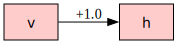
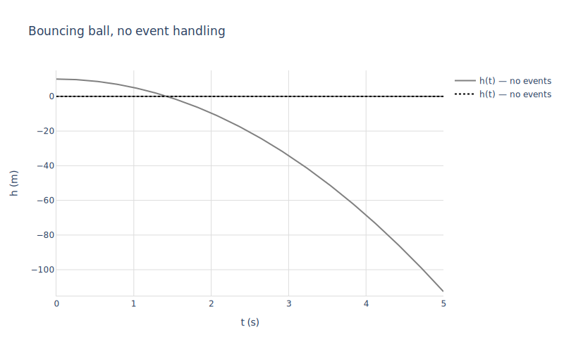
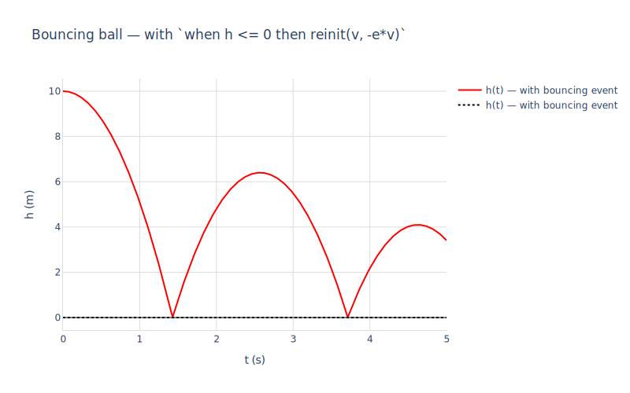
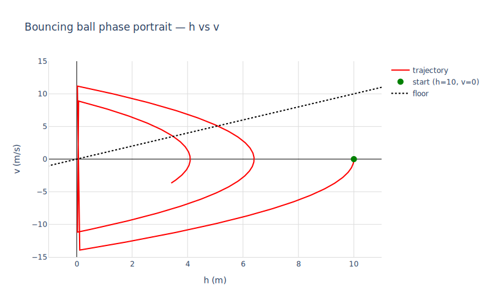

# 04 — Discrete events (bouncing ball)

The previous notebook (`03_nonlinear.macnb`) integrated **continuous** nonlinear dynamics — `sin(theta)` gravity, viscous damping, sinusoidal forcing. But many real systems also have **discrete events**: instants where the state of the world changes discontinuously. Classic examples:

- A ball hitting the floor and reversing velocity (this notebook).
- A diode switching on or off.
- A relay flipping when a signal crosses a threshold.
- A gear shifting in a transmission.

Modelica expresses these with `when (condition) then ... reinit(state, new_value) end when;`. rumoca surfaces the condition as a separate `f_c` block in its JSON, and the reset rule as an `f_z` discrete equation. mochi-nonlinear's `mod_simulate_nonlinear` accepts these via the `'events` opt: each entry is a `[event_expr, reset_eqs]` pair. SUNDIALS CVODE detects zero crossings of `event_expr` (its rootfinder), and the loop applies `reset_eqs` to compute the post-event state and restart integration.


```maxima
load("../../mochi.mac")$
load("numerics")$
load("numerics-sundials")$
load("../../mochi-nonlinear.mac")$
load("ax-plots")$
```

## 1. The Bouncing Ball model

```modelica
model BouncingBall
  parameter Real e = 0.8;        // coefficient of restitution
  parameter Real g = 9.81;
  Real h(start = 10);            // height above ground
  Real v(start = 0);             // upward velocity
equation
  der(h) = v;
  der(v) = -g;
  when h <= 0 and v < 0 then
    reinit(v, -e * pre(v));
  end when;
end BouncingBall;
```

Two states ($h$, $v$), no inputs, no explicit output. Continuous dynamics: free-fall under gravity ($\dot v = -g$, $\dot h = v$). Discrete event: when the ball hits the floor (`h ≤ 0`) while moving downward (`v < 0`), velocity reverses and is multiplied by the coefficient of restitution $e$.


```maxima
m : mod_load("../BouncingBall.mo")$
mod_print(m)$
```

    Model:  BouncingBall
      parameters:  [[e,0.8],[g,9.81]]
      states:      [h,v]
      derivs:      [der_h,der_v]
      inputs:      []
      outputs:     []
      initial:     [[h,10],[v,0]]
      residuals:
         der_h-v  = 0
         g+der_v  = 0

Notice the residuals are continuous-only — `der_h - v = 0` and `g + der_v = 0`. The `when` clause is *not* in the residual list; it lives in rumoca's discrete `f_z` block, which mochi exposes through the `'events` opt of `mod_simulate_nonlinear` rather than through the continuous DAE.

## 2. Continuous dataflow

Here's the linearised dataflow diagram for the **continuous** part of the model — i.e. the free-fall dynamics without the bounce. With no input and no output, the diagram just shows how the two states feed into each other's derivatives:


```maxima
mod_diagram(m, [h = 1, v = 0])$
```


    

    


$v$ feeds `der_h` (the kinematic relation $\dot h = v$), and the constant $-g$ contributes to `der_v` — but since `-g` is a parameter and not a state, it doesn't appear as an edge. The diagram captures only the linear *state-to-state* coupling. The discrete event (the bounce) is invisible in this view: it's a step that happens between integrator calls, not a continuous edge.

## 3. Without events: ball falls through the floor

To start, simulate without the event handling — just continuous free fall. The ball passes through `h = 0` and keeps accelerating downward.


```maxima
[t_no_event, x_no_event] :
  mod_simulate_nonlinear(m, [10.0, 0.0],
                         lambda([t], []),
                         5.0,
                         ['return = 'states])$

ax_draw2d(
  color="gray", line_width=2, name="h(t) — no events",
  lines(t_no_event, map(first, x_no_event)),
  color="black", dash="dot", explicit(0, t, 0, 5),
  title="Bouncing ball, no event handling",
  xlabel="t (s)", ylabel="h (m)",
  yrange=[-115, 15],
  grid=true, showlegend=true
)$
```


    

    


By $t=5$ the ball is more than 100 m below ground — physically meaningless without the floor's contact constraint.

## 4. With events: the ball bounces

Now wire up the event. We pass a single `[event_expr, reset_eqs]` pair to `mod_simulate_nonlinear`:

- `event_expr = h` — CVODE detects each zero crossing of $h$ (i.e. the moments the ball reaches ground level).
- `reset_eqs = [v = -e * v]` — at each event, replace velocity with $-e \cdot v_{\text{pre}}$, applying the coefficient of restitution.

The integrator loop runs CVODE between requested sample times; whenever a zero-crossing fires, it stops, applies the reset, and restarts from the post-reset state.


```maxima
[t_evt, x_evt] :
  mod_simulate_nonlinear(m, [10.0, 0.0],
                         lambda([t], []),
                         5.0,
                         ['return = 'states,
                          'events = [[h, [v = -e * v]]]])$

ax_draw2d(
  color="red", line_width=2, name="h(t) — with bouncing event",
  lines(t_evt, map(first, x_evt)),
  color="black", dash="dot", explicit(0, t, 0, 5),
  title="Bouncing ball — with `when h <= 0 then reinit(v, -e*v)`",
  xlabel="t (s)", ylabel="h (m)",
  grid=true, showlegend=true
)$
```


    

    


Each cusp is a bounce: the ball decelerates as it falls, reverses direction at the floor (with $80\%$ of its incoming speed because $e = 0.8$), rises to a lower peak, and comes back down. The bounces become arbitrarily close in time — Zeno-like behaviour — but `mod_simulate_nonlinear` has a watchdog (`event_dedup_eps = 1e-3`, max 100 events per segment) that breaks the loop before it explodes numerically.

## 5. Phase portrait

Plotting velocity vs height makes the bounces unmistakable: each bounce is a **vertical jump** in the $v$ direction at the $h = 0$ axis (continuous dynamics → smooth curve, discrete reset → straight vertical edge).


```maxima
ax_draw2d(
  color="red", line_width=2, name="trajectory",
  lines(map(first, x_evt), map(second, x_evt)),
  marker_size=10, color="green", name="start (h=10, v=0)",
  points([first(x_evt)[1]], [first(x_evt)[2]]),
  color="black", dash="dot", name="floor",
  explicit(v, v, -15, 15),
  title="Bouncing ball phase portrait — h vs v",
  xlabel="h (m)", ylabel="v (m/s)",
  xrange=[-1, 11], yrange=[-15, 15],
  grid=true, showlegend=true
)$
```


    

    


The phase trajectory spirals inward: each bounce loses 36% of the kinetic energy ($1 - e^2 = 1 - 0.64 = 0.36$), so the velocity at successive ground hits decays geometrically. The vertical jumps along the $h = 0$ line are the event resets — the only place the trajectory isn't smooth.

## What we got

`mod_simulate_nonlinear`'s `'events` opt is the bridge between Modelica's `when (condition) then reinit(state, expr) end when` clauses and SUNDIALS CVODE's rootfinding. The user supplies pairs of `[event_expr, reset_eqs]`; the integrator loop:

1. Calls `np_cvode` over `[current_t, next_t]` with `event_expr` as a CVODE root function.
2. If a zero crossing fires, evaluates `reset_eqs` against the state at the event to compute the new state.
3. Nudges the post-reset state forward by a tiny Euler half-step (so CVODE doesn't immediately re-detect the same zero crossing on the boundary).
4. Restarts and continues.

The same machinery handles ideal diodes, threshold-triggered controllers, gearbox shifts, comparator-based hysteresis, and any other plant whose state takes a discontinuous step at well-defined moments.
