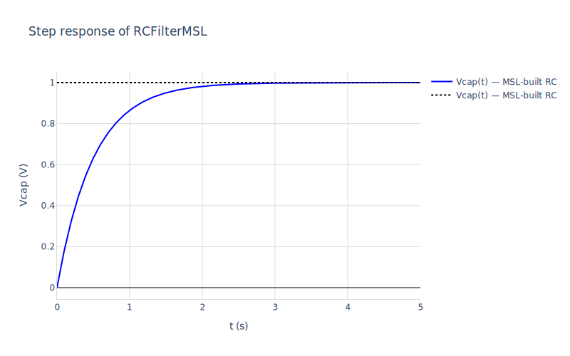
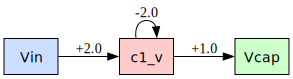

# 05 — Modelica Standard Library

The Modelica Standard Library (MSL) ships ~1500 components across electrical, mechanical, rotational, translational, thermal, fluid, and signal-processing domains. Every component is professionally-maintained, unit-checked, and documented. Building plants out of MSL components — rather than hand-rolling our own `Resistor.mo`, `Capacitor.mo`, etc. — is what most working control engineers want from a Modelica tool.

mochi resolves cross-package references like `Modelica.Electrical.Analog.Basic.Resistor` by passing rumoca's `--source-root` through. As long as MSL is reachable from `MODELICAPATH` (the standard Modelica-tools env var, defined in [MLS §13.2.4](https://specification.modelica.org/master/packages.html#mapping-package-class-structures-to-a-hierarchical-file-system)) — or your machine has OpenModelica installed — `mod_load` works on MSL-using files transparently.

This notebook walks through:

1. Where mochi looks for MSL.
2. Loading a plant built from MSL components (an RC filter).
3. Verifying it produces identical dynamics to the hand-rolled `RCFilter.mo`.
4. Multi-domain modelling: a DC motor combining `Modelica.Electrical.Analog` and `Modelica.Mechanics.Rotational`.
5. The known limitation around `Modelica.Blocks` linearisation.


```maxima
load("../../mochi.mac")$
load("numerics")$
load("ax-plots")$
```

## 1. Source-root discovery

`mod_source_roots()` returns the directories rumoca will search for cross-package references. Resolution rules — explicit configuration always wins:

1. `mod_set_source_root(path1, path2, ...)` or `mod_add_source_root(path)` set programmatically from Maxima.
2. Otherwise, the `MODELICAPATH` environment variable (multi-path: colon-separated on Unix, semicolon-separated on Windows).
3. Otherwise, fall back to OpenModelica's `$OPENMODELICAHOME/lib/omlibrary/Modelica*/` — the one tool-managed location widely deployed on Unix systems.

The cell below abbreviates each path's first two segments (the home-prefix dir like `Users` or `home`, and the username) to `.../` so the rendered notebook doesn't bake in the author's home directory. Run the bare `mod_source_roots()` on your own install to see the literal paths.


```maxima
map(lambda([p], sconcat(".../", simplode(rest(split(p, "/"), 2), "/"))),
    mod_source_roots());
```


```math
\left[ \text{ .../.modelica/library/Modelica } \right] 
```


(If that's empty, set `MODELICAPATH` in your shell or use `mod_set_source_root` — see the README's *Prerequisites → Modelica Standard Library* section. The rest of this notebook needs MSL reachable from one of those.)

## 2. RC filter, MSL edition

`examples/msl/RCFilterMSL.mo` is the same RC plant as `examples/RCFilter.mo`, but composed from MSL components rather than hand-rolled ones:

```modelica
model RCFilterMSL
  Modelica.Electrical.Analog.Basic.Resistor   r1(R = 1.0);
  Modelica.Electrical.Analog.Basic.Capacitor  c1(C = 0.5);
  Modelica.Electrical.Analog.Basic.Ground     gnd;
  Modelica.Electrical.Analog.Sources.SignalVoltage src;
  input  Real Vin;
  output Real Vcap;
equation
  src.v = Vin;
  Vcap  = c1.v;
  connect(src.p, r1.p);
  connect(r1.n,  c1.p);
  connect(c1.n,  gnd.p);
  connect(src.n, gnd.p);
end RCFilterMSL;
```

No connector class, no `partial model OnePort` base — those live in `Modelica.Electrical.Analog.Interfaces`, and rumoca pulls them in via `--source-root`. Each MSL `Resistor` / `Capacitor` already extends MSL's `OnePort`, which extends MSL's connector — the whole chain just works.


```maxima
m_msl : mod_load("../msl/RCFilterMSL.mo")$
mod_print(m_msl)$
```

    Model:  RCFilterMSL
      parameters:
                  [[r1_useHeatPort,false],[r1_R,1.0],[r1_T_ref,300.15],
                   [r1_alpha,0],[c1_C,0.5],[r1_T,r1_T_ref]]
      states:      [c1_v]
      derivs:      [der_c1_v]
      inputs:      [Vin]
      outputs:     [Vcap]
      initial:     [[c1_v,0]]
      residuals:
         -r1_p_i-r1_n_i  = 0
         r1_i-r1_p_i  = 0
         r1_v-r1_p_v+r1_n_v  = 0
         r1_T_heatPort-r1_T  = 0
         r1_R_actual-r1_R*((r1_T_heatPort-r1_T_ref)*r1_alpha+1)  = 0
         r1_v-r1_R_actual*r1_i  = 0
         r1_LossPower-r1_i*r1_v  = 0
         -c1_p_i-c1_n_i  = 0
         c1_i-c1_p_i  = 0
         c1_v-c1_p_v+c1_n_v  = 0
         c1_i-c1_C*der_c1_v  = 0
         gnd_p_v  = 0
         src_v-src_p_v+src_n_v  = 0
         -src_p_i-src_n_i  = 0
         src_i-src_p_i  = 0
         src_v-Vin  = 0
         Vcap-c1_v  = 0
         src_p_i+r1_p_i  = 0
         r1_n_i+c1_p_i  = 0
         src_n_i+gnd_p_i+c1_n_i  = 0
         src_p_v-r1_p_v  = 0
         r1_n_v-c1_p_v  = 0
         c1_n_v-gnd_p_v  = 0
         gnd_p_v-src_n_v  = 0

Notice the residuals: 23 of them, including the connector-flattened currents and voltages (`r1_p_i`, `c1_p_v`, etc.). The `R_actual` and `LossPower` come from MSL's `ConditionalHeatPort` — built into MSL's resistor for thermal coupling, but with `useHeatPort = false` it stays decoupled and just contributes a constant `T_heatPort = T_ref`. We get all of that for free.

## 3. Same dynamics as the hand-rolled version

Linearise around the equilibrium and verify the matrices match `examples/RCFilter.mo`:


```maxima
[A, B, C, D] : mod_state_space(m_msl, [c1_v = 0, Vin = 0])$
print("A =")$ A;
print("B =")$ B;
print("C =")$ C;
print("D =")$ D;
```

    A =
    matrix([-2.0])
    B =
    matrix([2.0])
    C =
    matrix([1.0])
    D =


```math
\begin{pmatrix} 0.0\end{pmatrix} 
```


$A = -2$, $B = 2$, $C = 1$, $D = 0$ — exactly the matrices we got from the hand-rolled `RCFilter.mo` in `01_linear_analysis.macnb`. With $R = 1$ and $C = 0.5$, $A = -1/(RC) = -2$ and $B = 1/(RC) = 2$. Same plant, expressed via standard library components.

## 4. Step response

DC gain $= -CA^{-1}B + D = 1$, so a unit step settles at 1.0:


```maxima
[t_step, y_step] : mod_step(m_msl, [c1_v = 0, Vin = 0], 5.0)$

ax_draw2d(
  color="blue", line_width=2, name="Vcap(t) — MSL-built RC",
  lines(t_step, y_step),
  color="black", dash="dot", explicit(1, t, 0, 5),
  title="Step response of RCFilterMSL",
  xlabel="t (s)", ylabel="Vcap (V)",
  grid=true, showlegend=true
)$
```


    

    


## 5. Dataflow diagram

`mod_diagram` works the same way regardless of whether the model is MSL- or hand-built:


```maxima
mod_diagram(m_msl, [c1_v = 0, Vin = 0])$
```


    

    


## 6. Closed-loop with `Modelica.Blocks.Continuous.PID`

The dream demo: build a closed-loop control system entirely from MSL Blocks. `examples/msl/PIDClosedLoop.mo` wires:

```
setpoint --[+]--> PID --> plant ---> output
              ^                       |
              +-----------------------+
```

— a `Modelica.Blocks.Continuous.FirstOrder` plant, a `Modelica.Blocks.Continuous.PID` controller, and a `Modelica.Blocks.Math.Feedback` block to close the loop. No hand-rolled blocks. mochi linearises this directly: the structural work is already done by rumoca + the loader, and `mod_state_space`'s constant-folding pass collapses the parameter-gated `If` branches inside MSL's PID (the derivative-filter shortcut etc.) before the Jacobian sees them.


```maxima
m_pid : mod_load("../msl/PIDClosedLoop.mo")$
mod_print(m_pid)$
```

    rat: replaced -1.0e-13 by -1/10000000000000 = -1.0e-13
    Model:  PIDClosedLoop
      parameters:
                  [[plant_k,1.0],[plant_T,1.0],
                   [plant_initType,Modelica_Blocks_Types_Init_NoInit],
                   [plant_y_start,0],[pid_k,1.0],[pid_Ti,0.5],[pid_Td,0.1],
                   [pid_Nd,10],
                   [pid_initType,Modelica_Blocks_Types_Init_InitialState],
                   [pid_xi_start,0],[pid_xd_start,0],[pid_y_start,0],[pid_P_k,1],
                   [pid_I_use_reset,false],[pid_I_use_set,false],
                   [pid_D_y_start,0],[pid_Gain_k,1.0],[pid_Add_k1,1],
                   [pid_Add_k2,1],[pid_Add_k3,1],[setpoint_offset,0],
                   [setpoint_startTime,0],[setpoint_height,1.0],
                   [pid_I_k,pid_unitTime/pid_Ti],[pid_D_k,pid_Td/pid_unitTime],
                   [pid_D_T,max(1.0e-13,pid_Td/pid_Nd)],
                   [pid_I_initType,
                    if pid_initType = Modelica_Blocks_Types_Init_SteadyState
                        then Modelica_Blocks_Types_Init_SteadyState
                        else (if pid_initType
                                   = Modelica_Blocks_Types_Init_InitialState
                                  then Modelica_Blocks_Types_Init_InitialState
                                  else Modelica_Blocks_Types_Init_NoInit)],
                   [pid_D_initType,
                    if pid_initType = Modelica_Blocks_Types_Init_SteadyState
                         or pid_initType = Modelica_Blocks_Types_Init_InitialOutput
                        then Modelica_Blocks_Types_Init_SteadyState
                        else (if pid_initType
                                   = Modelica_Blocks_Types_Init_InitialState
                                  then Modelica_Blocks_Types_Init_InitialState
                                  else Modelica_Blocks_Types_Init_NoInit)],
                   [pid_I_y_start,pid_xi_start],[pid_D_x_start,pid_xd_start],
                   [pid_D_zeroGain,abs(pid_D_k) < 1.0e-15],[pid_unitTime,1]]
      states:      [plant_y,pid_I_y,pid_D_x]
      derivs:      [der_plant_y,der_pid_I_y,der_pid_D_x]
      inputs:      []
      outputs:     []
      initial:     [[plant_y,0],[pid_I_y,0],[pid_D_x,pid_D_x_start]]
      residuals:
         der_plant_y-(plant_k*plant_u-plant_y)/plant_T  = 0
         pid_P_y-pid_P_k*pid_P_u  = 0
         pid_I_local_set  = 0
         der_pid_I_y-pid_I_k*pid_I_u  = 0
         der_pid_D_x-(if pid_D_zeroGain then 0 else (pid_D_u-pid_D_x)/pid_D_T)
         = 0
        pid_D_y-(if pid_D_zeroGain then 0
                     else (pid_D_k*(pid_D_u-pid_D_x))/pid_D_T)  = 0
         pid_Gain_y-pid_Gain_k*pid_Gain_u  = 0
        pid_Add_y-pid_Add_k3*pid_Add_u3-pid_Add_k2*pid_Add_u2
                 -pid_Add_k1*pid_Add_u1  = 0
        -(if time < setpoint_startTime then 0 else setpoint_height)
         +setpoint_y-setpoint_offset  = 0
         fb_y+fb_u2-fb_u1  = 0
         pid_u-pid_P_u  = 0
         pid_P_u-pid_I_u  = 0
         pid_I_u-pid_D_u  = 0
         pid_D_u-fb_y  = 0
         pid_P_y-pid_Add_u1  = 0
         pid_I_y-pid_Add_u2  = 0
         pid_D_y-pid_Add_u3  = 0
         pid_Add_y-pid_Gain_u  = 0
         pid_Gain_y-pid_y  = 0
         pid_y-plant_u  = 0
         setpoint_y-fb_u1  = 0
         plant_y-fb_u2  = 0

Three states: `plant.y` (the first-order plant's output), `pid.I.y` (the integrator), `pid.D.x` (the derivative filter). 32 parameters, mostly internal MSL defaults. Linearise:


```maxima
[A_pid, B_pid, C_pid, D_pid] :
  mod_state_space(m_pid, [plant_y = 0, pid_I_y = 0, pid_D_x = 0])$
print("A =")$ A_pid;
```

    rat: replaced -1.0e-13 by -1/10000000000000 = -1.0e-13
    A =


```math
\begin{pmatrix} -12.0&1.0&-10.0\\ -2.0&0.0&0.0\\ -99.99999999999999&0.0&-99.99999999999999\end{pmatrix} 
```


States / inputs / outputs at the top level:


```maxima
[length(A_pid), length(B_pid[1]), length(C_pid)];
```


```math
\left[ 3 , 0 , 0 \right] 
```


The 3×3 A matrix is dense — every state couples to the others through the feedback path. There are no inputs left at the top level (the setpoint is internal, fed by the `Step` source via `setpoint.y → fb.u1`), so B is empty; same for C, D since no `output Real` is declared.

Closed-loop pole locations are the eigenvalues of A:


```maxima
[eigvals, eigvecs] : np_eig(ndarray(float(A_pid)))$
np_to_list(eigvals);
```


```math
\left[ -110.18316306162187 , 0.9949548970401114\,i-0.9084184691890487 , -\left(0.9949548970401114\,i\right)-0.9084184691890487 \right] 
```


Three poles: one fast real pole around $-110$ (that's the derivative-filter dynamics, with $T_D = T_d / N_d = 0.01$, giving $-1/T_D = -100$), and a complex conjugate pair around $-0.91 \pm 0.99j$ — the dominant closed-loop dynamics, slightly underdamped, $\zeta \approx 0.67$. All in the left half-plane: stable closed loop.

That's the workflow this notebook was meant to demonstrate: take an MSL plant, wrap it in an MSL controller, get the linearised state-space to do classical analysis (poles, Bode, Nyquist), and feed it into whatever control-design tools you like.

## What we got

mochi reads MSL components transparently. The user just declares them:

```modelica
Modelica.Electrical.Analog.Basic.Resistor r(R = 100);
Modelica.Blocks.Continuous.PID pid(k = 1.0, Ti = 0.5, Td = 0.1);
```

and rumoca + mochi handle the entire flattening — connector expansion, type-alias resolution (`SI.Resistance`, `SI.Voltage`), parent-class inheritance, parameter-expression evaluation (`D.T = max({Td/Nd, 100*1e-15})`), multi-domain interfaces, parameter-gated `If` branches, the works.

Three plants, all the same dynamics:

- `examples/RCFilter.mo` — hand-rolled connector + components.
- `examples/extends/RCFilterExtends.mo` — refactored with a `partial model OnePort` base.
- `examples/msl/RCFilterMSL.mo` — composed from MSL components.

All three linearise to A = -2, B = 2, C = 1, D = 0. Three different ways to spell the same plant. The MSL version is the one most working control engineers will reach for first: standard names, professionally maintained, multi-domain, full unit checking, hooks for thermal coupling and loss-power output.

What this unlocks:

- Use the right physical component out of MSL's 1500+ catalogue.
- Multi-domain modelling (electrical-mechanical-thermal-fluid) without writing the bridge components yourself.
- Closed-loop design with MSL's `Modelica.Blocks.Continuous.{P, PI, PID, LimPID}` and friends — load, linearise, design, simulate, all in mochi.
