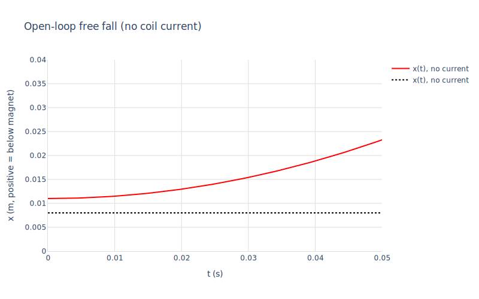
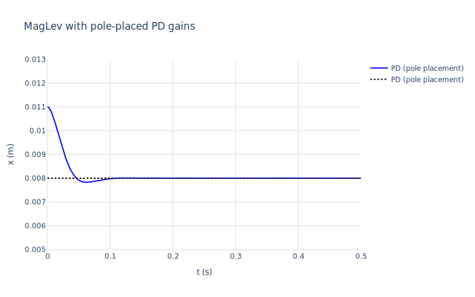
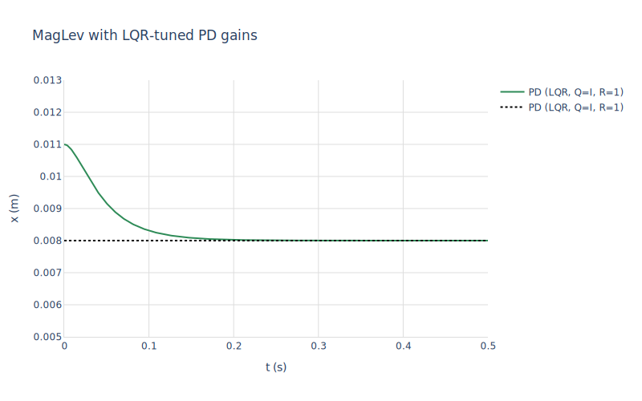
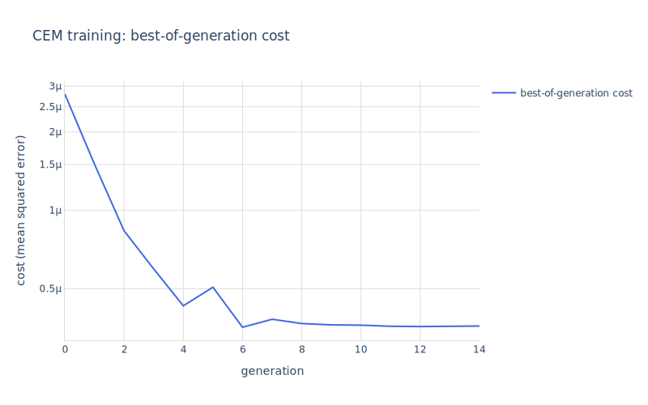
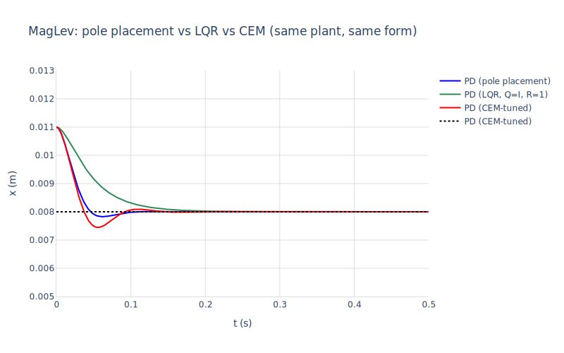

# 06 — Reinforcement learning a MagLev controller

A steel ball is suspended below an electromagnet by an attractive force $\propto i^2 / x^2$, fighting gravity. Open-loop the system is *unstable*: drop the current and the ball falls; raise it slightly and the ball slams into the magnet. A controller has to keep the ball at a target distance below the magnet using only position feedback.

This notebook does the same control problem **three ways** against the same Modelica plant:

1. **Pole placement**: linearise around the equilibrium with `mod_state_space`, choose where the closed-loop poles should go, solve for the gains.
2. **LQR**: linearise, supply quadratic state and input penalty matrices, get the optimal gains in one shot via `mod_lqr`.
3. **Reinforcement learning**: black-box optimise the same PD gains with `np_cem` (cross-entropy method) directly against the *nonlinear* plant — no linearisation, no operating-point assumption.

The interesting comparison is what each method gets you. Pole placement and LQR both work on the linearised plant but ask different questions of the engineer; CEM treats the simulator as a black box and tunes against actual nonlinear dynamics, including the inverse-square magnetic-force term.


```maxima
load("../../mochi.mac")$
load("numerics")$
load("numerics-sundials")$
load("numerics-learn")$
load("../../mochi-nonlinear.mac")$
load("ax-plots")$
```

## 1. The plant

$$m\,\ddot{x} = m g - \frac{k_m i^2}{x^2}$$

where $x$ is the ball's distance below the magnet (positive downward), $i$ is the coil current, and $k_m$, $m$, $g$ are constants. The bias current $i_{\text{bias}}$ is the value at which gravity exactly balances the magnetic force at the setpoint $x_{\text{ref}}$:

$$i_{\text{bias}} = \sqrt{\frac{m g x_{\text{ref}}^2}{k_m}}$$

It's declared as a *parameter-of-parameters* in `MagLev.mo`; mochi's fixed-point resolver folds the expression to a number.


```maxima
m : mod_load("../MagLev.mo")$
mod_print(m)$
```

    Model:  MagLev
      parameters:
                  [[ball_mass,0.02],[grav,9.81],[km,1.6e-4],[x_ref,0.008],
                   [i_bias,sqrt((ball_mass*grav)/km)*abs(x_ref)]]
      states:      [x,v]
      derivs:      [der_x,der_v]
      inputs:      [coil_i]
      outputs:     [y]
      initial:     [[x,0.011],[v,0.0]]
      residuals:
         der_x-v  = 0
         (coil_i^2*km)/(ball_mass*x^2)-grav+der_v  = 0
         y-x  = 0

## 2. Open-loop check: the ball falls

With `coil_i = 0` the magnetic force vanishes; the ball just free-falls. We start it slightly below the setpoint at $x_0 = 0.011$ m.


```maxima
[t_open, x_open] : mod_simulate_nonlinear(
    m, [0.011, 0.0], lambda([t], [0.0]), 0.05,
    ['return = 'states, 'dt = 0.0005])$

ax_draw2d(
  color="red", line_width=2, name="x(t), no current",
  lines(t_open, map(first, x_open)),
  color="black", dash="dot",
  explicit(0.008, t, 0, 0.05),
  title="Open-loop free fall (no coil current)",
  xlabel="t (s)", ylabel="x (m, positive = below magnet)",
  yrange=[0, 0.04],
  grid=true, showlegend=true)$
```


    

    


## 3. Linearise → pole placement (the textbook approach)

Linearise around the equilibrium $(x = x_{\text{ref}}, v = 0, i = i_{\text{bias}})$. The state-space form is small (2 states, 1 input) so we can read $A$, $B$ off `mod_state_space` directly:


```maxima
[A, B, C, D] : mod_state_space(m, [x = 0.008, v = 0, coil_i = 0.28])$
print("A =")$ A;
print("B =")$ B;

/* Open-loop poles: A has one positive eigenvalue → unstable. */
[evals, _] : np_eig(ndarray(float(A)))$
print("open-loop eigenvalues:", np_to_list(evals))$
```

    A =
    matrix([0.0,1.0],[2450.0000000000005,0.0])
    B =
    matrix([0.0],[-70.0])
    open-loop eigenvalues: [49.49747468305833,-49.497474683058336]

The positive eigenvalue makes this unstable, exactly as expected. We close the loop with $u = i_{\text{bias}} + k_1 (x - x_{\text{ref}}) + k_2 v$ and choose $(k_1, k_2)$ so the closed-loop poles are at $-50 \pm 50i$ (a damped, fast pair). For this 2×2 the math is closed form: with $A_{cl}[2,1] = 2452 - 70 k_1$ and $A_{cl}[2,2] = -70 k_2$, matching $s^2 + 100s + 5000$ gives $k_1 \approx 106.5$, $k_2 \approx 1.43$.


```maxima
/* Pole-placed gains for closed-loop poles at -50 ± 50i.
   Note k1 must be > 2452/70 ≈ 35 just to get stability, and the
   double-derivative on x gives a *positive* spring back to the
   wall, so the gain has to be sized to overcome it. */
k1_lin : 106.5$
k2_lin : 1.43$

/* Verify the closed-loop pole locations numerically. */
A_cl : matrix([0, 1], [2452 - 70*k1_lin, -70*k2_lin])$
[evals_cl, _] : np_eig(ndarray(float(A_cl)))$
print("closed-loop eigenvalues:", np_to_list(evals_cl))$

/* Close the loop and simulate the *nonlinear* plant from the same IC. */
u_pd : buildq([k1v : k1_lin, k2v : k2_lin],
              lambda([t], [i_bias + k1v * (x - x_ref) + k2v * v]))$

[t_pd, x_pd] : mod_simulate_nonlinear(
    m, [0.011, 0.0], u_pd, 0.5,
    ['return = 'states, 'dt = 0.001])$

ax_draw2d(
  color="blue", line_width=2, name="PD (pole placement)",
  lines(t_pd, map(first, x_pd)),
  color="black", dash="dot",
  explicit(0.008, t, 0, 0.5),
  title="MagLev with pole-placed PD gains",
  xlabel="t (s)", ylabel="x (m)",
  yrange=[0.005, 0.013],
  grid=true, showlegend=true)$
```

    closed-loop eigenvalues:
                            [49.979970988386945*%i-50.05000000000001,
                             -(49.979970988386945*%i)-50.05000000000001]


    

    


## 4. Same plant, optimal control via LQR

Pole placement asks the engineer to pick *where* the closed-loop poles should go. LQR asks a different question: *what does it cost me when the state deviates and when I use control?* We supply two penalty matrices — $Q$ on the state and $R$ on the input — and `mod_lqr` returns the gain that minimises

$$J = \int_0^\infty \big( \tilde x^\top Q\, \tilde x + \tilde u^\top R\, \tilde u \big) \, dt$$

over the linearised plant ($\tilde x = x - x_{\text{ref}}$, $\tilde u = i - i_{\text{bias}}$). Internally `mod_lqr` calls `mod_state_space` to get $A, B$ and then `np_lqr` to solve the algebraic Riccati equation.

With $Q = I$, $R = [1]$ — the "no special preference" choice — LQR returns gains that produce two real, distinct closed-loop poles. Slower than the pole-placed pair, but no overshoot. The $Q/R$ ratio is the knob: larger $Q$ pushes harder for state error and gets faster, more aggressive control; larger $R$ does the opposite.


```maxima
K_lqr_mat : mod_lqr(m, [x = 0.008, v = 0, coil_i = 0.28],
                     matrix([1.0, 0.0], [0.0, 1.0]),
                     matrix([1.0]))$
print("LQR gain K =", K_lqr_mat)$

/* mod_lqr returns K such that u_tilde = -K * x_tilde, so to wire it
   into the same `u = i_bias + k1*(x - x_ref) + k2*v` policy form
   used above we negate the matrix elements. */
k1_lqr : -K_lqr_mat[1,1]$
k2_lqr : -K_lqr_mat[1,2]$
printf(true, "effective k1 = ~,2f, k2 = ~,2f~%", k1_lqr, k2_lqr)$

/* Closed-loop eigenvalues for sanity. */
[evals_lqr, _] : np_eig(ndarray(float(matrix([0, 1],
                                              [2452 - 70*k1_lqr,
                                               -70*k2_lqr]))))$
print("closed-loop eigenvalues:", np_to_list(evals_lqr))$

u_lqr : buildq([k1v : k1_lqr, k2v : k2_lqr],
                lambda([t], [i_bias + k1v * (x - x_ref) + k2v * v]))$

[t_lqr, x_lqr] : mod_simulate_nonlinear(
    m, [0.011, 0.0], u_lqr, 0.5,
    ['return = 'states, 'dt = 0.001])$

ax_draw2d(
  color="seagreen", line_width=2, name="PD (LQR, Q=I, R=1)",
  lines(t_lqr, map(first, x_lqr)),
  color="black", dash="dot",
  explicit(0.008, t, 0, 0.5),
  title="MagLev with LQR-tuned PD gains",
  xlabel="t (s)", ylabel="x (m)",
  yrange=[0.005, 0.013],
  grid=true, showlegend=true)$
```

    LQR gain K = matrix([-70.01428280002321,-1.7321686061121955])
    effective k1 = 70.01, k2 = 1.73
    o148
    closed-loop eigenvalues: [-25.60447774201195,-95.64732468584175]


    

    


## 5. Same controller form, gains learned by CEM

Now we let the cross-entropy method tune the same two gains by black-box rollout. Each generation, `np_cem` samples 30 candidate $(k_1, k_2)$ pairs from a Gaussian, runs each through `mod_simulate_nonlinear` for half a second, scores the trajectory by mean squared position error plus a small velocity penalty, keeps the best 8, and refits the Gaussian to the survivors.

What's worth noticing about the cost function: the policy is written as a Maxima expression in the model's *symbolic* state names (`x`, `v`) and parameters (`i_bias`, `x_ref`). `mod_simulate_nonlinear` substitutes the parameters and compiles the resulting expression to a native Lisp closure. There's no callback into the Maxima evaluator on each integration step.


```maxima
cem_cost(params_arr) := block(
  [k1, k2, u_fn, sim, x_traj, errs],
  k1 : np_ref(params_arr, 0),
  k2 : np_ref(params_arr, 1),
  /* Closed-loop policy (no clipping in the integrator — let the smooth
     expression go to coerce-float-fun; we won't pursue gains that
     demand absurd current). */
  u_fn : buildq([k1v : k1, k2v : k2],
                lambda([t], [i_bias + k1v * (x - x_ref) + k2v * v])),
  /* Wild candidates can blow up CVODE — errcatch and return a large
     finite cost so CEM still ranks them and converges. */
  sim : errcatch(mod_simulate_nonlinear(
                   m, [0.011, 0.0], u_fn, 0.5,
                   ['return = 'states, 'dt = 0.001,
                    'rtol = 1e-8, 'atol = 1e-10])),
  if sim = [] then return(1e6),
  x_traj : second(first(sim)),
  errs : map(lambda([state], (state[1] - 0.008)^2 + 1e-4 * state[2]^2),
             x_traj),
  float(apply("+", errs)) / length(errs))$

/* Sanity: cost of the pole-placed gains. */
print("PD cost:", cem_cost(ndarray([k1_lin, k2_lin], [2])))$
```

    PD cost: 3.3523450959124696e-7


```maxima
np_seed(7)$

[best, hist] :
  np_cem(cem_cost, 2,
         n_samples=30, n_elites=8, n_gens=15,
         sigma0=50.0, sigma_min=0.5,
         mu0=ndarray([20.0, 50.0], [2]))$

k1_cem : np_ref(best, 0)$
k2_cem : np_ref(best, 1)$
printf(true, "best gains: k1 = ~,2f, k2 = ~,2f~%", k1_cem, k2_cem)$
printf(true, "final cost: ~,3e~%", last(np_to_list(hist)))$
```

    [ERROR][rank 0][/private/tmp/sundials-20260406-7535-hqs0wm/sundials-7.7.0/src/cvode/cvode.c:1487][CVode] At t = 0.0014303320194092, mxstep steps taken before reaching tout.
    CVode: SUNDIALS error (flag=-1): too much work (increase max_steps or try a different method)
    [ERROR][rank 0][/private/tmp/sundials-20260406-7535-hqs0wm/sundials-7.7.0/src/cvode/cvode.c:1487][CVode] At t = 0.00347298503946232, mxstep steps taken before reaching tout.
    CVode: SUNDIALS error (flag=-1): too much work (increase max_steps or try a different method)
    [ERROR][rank 0][/private/tmp/sundials-20260406-7535-hqs0wm/sundials-7.7.0/src/cvode/cvode.c:1487][CVode] At t = 0.00359162241723439, mxstep steps taken before reaching tout.
    CVode: SUNDIALS error (flag=-1): too much work (increase max_steps or try a different method)
    [ERROR][rank 0][/private/tmp/sundials-20260406-7535-hqs0wm/sundials-7.7.0/src/cvode/cvode.c:1487][CVode] At t = 0.00242770541907126, mxstep steps taken before reaching tout.
    CVode: SUNDIALS error (flag=-1): too much work (increase max_steps or try a different method)
    [ERROR][rank 0][/private/tmp/sundials-20260406-7535-hqs0wm/sundials-7.7.0/src/cvode/cvode.c:1487][CVode] At t = 0.00720630975138554, mxstep steps taken before reaching tout.
    CVode: SUNDIALS error (flag=-1): too much work (increase max_steps or try a different method)
    [ERROR][rank 0][/private/tmp/sundials-20260406-7535-hqs0wm/sundials-7.7.0/src/cvode/cvode.c:1487][CVode] At t = 0.0378522963918432, mxstep steps taken before reaching tout.
    CVode: SUNDIALS error (flag=-1): too much work (increase max_steps or try a different method)
    [WARNING][rank 0][/private/tmp/sundials-20260406-7535-hqs0wm/sundials-7.7.0/src/cvode/cvode.c:1516][CVode] Internal t = 0.0014303320194092 and h = 7.53778089312838e-20 are such that t + h = t on the next step. The solver will continue anyway.
    [WARNING][rank 0][/private/tmp/sundials-20260406-7535-hqs0wm/sundials-7.7.0/src/cvode/cvode.c:1516][CVode] Internal t = 0.0014303320194092 and h = 7.53778089312838e-20 are such that t + h = t on the next step. The solver will continue anyway.
    [WARNING][rank 0][/private/tmp/sundials-20260406-7535-hqs0wm/sundials-7.7.0/src/cvode/cvode.c:1516][CVode] Internal t = 0.0014303320194092 and h = 7.53778089312838e-20 are such that t + h = t on the next step. The solver will continue anyway.
    [WARNING][rank 0][/private/tmp/sundials-20260406-7535-hqs0wm/sundials-7.7.0/src/cvode/cvode.c:1516][CVode] Internal t = 0.0014303320194092 and h = 7.53778089312838e-20 are such that t + h = t on the next step. The solver will continue anyway.
    [WARNING][rank 0][/private/tmp/sundials-20260406-7535-hqs0wm/sundials-7.7.0/src/cvode/cvode.c:1516][CVode] Internal t = 0.0014303320194092 and h = 7.53778089312838e-20 are such that t + h = t on the next step. The solver will continue anyway.
    [WARNING][rank 0][/private/tmp/sundials-20260406-7535-hqs0wm/sundials-7.7.0/src/cvode/cvode.c:1516][CVode] Internal t = 0.0014303320194092 and h = 7.53778089312838e-20 are such that t + h = t on the next step. The solver will continue anyway.
    [WARNING][rank 0][/private/tmp/sundials-20260406-7535-hqs0wm/sundials-7.7.0/src/cvode/cvode.c:1516][CVode] Internal t = 0.0014303320194092 and h = 7.53778089312838e-20 are such that t + h = t on the next step. The solver will continue anyway.
    [WARNING][rank 0][/private/tmp/sundials-20260406-7535-hqs0wm/sundials-7.7.0/src/cvode/cvode.c:1516][CVode] Internal t = 0.0014303320194092 and h = 7.53778089312838e-20 are such that t + h = t on the next step. The solver will continue anyway.
    [WARNING][rank 0][/private/tmp/sundials-20260406-7535-hqs0wm/sundials-7.7.0/src/cvode/cvode.c:1516][CVode] Internal t = 0.0014303320194092 and h = 7.53778089312838e-20 are such that t + h = t on the next step. The solver will continue anyway.
    [WARNING][rank 0][/private/tmp/sundials-20260406-7535-hqs0wm/sundials-7.7.0/src/cvode/cvode.c:1516][CVode] Internal t = 0.0014303320194092 and h = 7.53778089312838e-20 are such that t + h = t on the next step. The solver will continue anyway.
    [WARNING][rank 0][/private/tmp/sundials-20260406-7535-hqs0wm/sundials-7.7.0/src/cvode/cvode.c:1521][CVode] The above warning has been issued mxhnil times and will not be issued again for this problem.
    [WARNING][rank 0][/private/tmp/sundials-20260406-7535-hqs0wm/sundials-7.7.0/src/cvode/cvode.c:1516][CVode] Internal t = 0.00347298503946232 and h = 1.86864393747061e-19 are such that t + h = t on the next step. The solver will continue anyway.
    [WARNING][rank 0][/private/tmp/sundials-20260406-7535-hqs0wm/sundials-7.7.0/src/cvode/cvode.c:1516][CVode] Internal t = 0.00347298503946232 and h = 1.86864393747061e-19 are such that t + h = t on the next step. The solver will continue anyway.
    [WARNING][rank 0][/private/tmp/sundials-20260406-7535-hqs0wm/sundials-7.7.0/src/cvode/cvode.c:1516][CVode] Internal t = 0.00347298503946232 and h = 1.86864393747061e-19 are such that t + h = t on the next step. The solver will continue anyway.
    [WARNING][rank 0][/private/tmp/sundials-20260406-7535-hqs0wm/sundials-7.7.0/src/cvode/cvode.c:1516][CVode] Internal t = 0.00347298503946232 and h = 1.86864393747061e-19 are such that t + h = t on the next step. The solver will continue anyway.
    [WARNING][rank 0][/private/tmp/sundials-20260406-7535-hqs0wm/sundials-7.7.0/src/cvode/cvode.c:1516][CVode] Internal t = 0.00347298503946232 and h = 1.86864393747061e-19 are such that t + h = t on the next step. The solver will continue anyway.
    [WARNING][rank 0][/private/tmp/sundials-20260406-7535-hqs0wm/sundials-7.7.0/src/cvode/cvode.c:1516][CVode] Internal t = 0.00347298503946232 and h = 1.86864393747061e-19 are such that t + h = t on the next step. The solver will continue anyway.
    [WARNING][rank 0][/private/tmp/sundials-20260406-7535-hqs0wm/sundials-7.7.0/src/cvode/cvode.c:1516][CVode] Internal t = 0.00347298503946232 and h = 1.86864393747061e-19 are such that t + h = t on the next step. The solver will continue anyway.
    [WARNING][rank 0][/private/tmp/sundials-20260406-7535-hqs0wm/sundials-7.7.0/src/cvode/cvode.c:1516][CVode] Internal t = 0.00347298503946232 and h = 1.86864393747061e-19 are such that t + h = t on the next step. The solver will continue anyway.
    [WARNING][rank 0][/private/tmp/sundials-20260406-7535-hqs0wm/sundials-7.7.0/src/cvode/cvode.c:1516][CVode] Internal t = 0.00347298503946232 and h = 1.86864393747061e-19 are such that t + h = t on the next step. The solver will continue anyway.
    [WARNING][rank 0][/private/tmp/sundials-20260406-7535-hqs0wm/sundials-7.7.0/src/cvode/cvode.c:1516][CVode] Internal t = 0.00347298503946232 and h = 1.86864393747061e-19 are such that t + h = t on the next step. The solver will continue anyway.
    [WARNING][rank 0][/private/tmp/sundials-20260406-7535-hqs0wm/sundials-7.7.0/src/cvode/cvode.c:1521][CVode] The above warning has been issued mxhnil times and will not be issued again for this problem.
    [WARNING][rank 0][/private/tmp/sundials-20260406-7535-hqs0wm/sundials-7.7.0/src/cvode/cvode.c:1516][CVode] Internal t = 0.00359162241723439 and h = 1.85238325997594e-19 are such that t + h = t on the next step. The solver will continue anyway.
    [WARNING][rank 0][/private/tmp/sundials-20260406-7535-hqs0wm/sundials-7.7.0/src/cvode/cvode.c:1516][CVode] Internal t = 0.00359162241723439 and h = 1.85238325997594e-19 are such that t + h = t on the next step. The solver will continue anyway.
    [WARNING][rank 0][/private/tmp/sundials-20260406-7535-hqs0wm/sundials-7.7.0/src/cvode/cvode.c:1516][CVode] Internal t = 0.00359162241723439 and h = 1.85238325997594e-19 are such that t + h = t on the next step. The solver will continue anyway.
    [WARNING][rank 0][/private/tmp/sundials-20260406-7535-hqs0wm/sundials-7.7.0/src/cvode/cvode.c:1516][CVode] Internal t = 0.00359162241723439 and h = 1.85238325997594e-19 are such that t + h = t on the next step. The solver will continue anyway.
    [WARNING][rank 0][/private/tmp/sundials-20260406-7535-hqs0wm/sundials-7.7.0/src/cvode/cvode.c:1516][CVode] Internal t = 0.00359162241723439 and h = 1.85238325997594e-19 are such that t + h = t on the next step. The solver will continue anyway.
    [WARNING][rank 0][/private/tmp/sundials-20260406-7535-hqs0wm/sundials-7.7.0/src/cvode/cvode.c:1516][CVode] Internal t = 0.00359162241723439 and h = 1.85238325997594e-19 are such that t + h = t on the next step. The solver will continue anyway.
    [WARNING][rank 0][/private/tmp/sundials-20260406-7535-hqs0wm/sundials-7.7.0/src/cvode/cvode.c:1516][CVode] Internal t = 0.00359162241723439 and h = 1.85238325997594e-19 are such that t + h = t on the next step. The solver will continue anyway.
    [WARNING][rank 0][/private/tmp/sundials-20260406-7535-hqs0wm/sundials-7.7.0/src/cvode/cvode.c:1516][CVode] Internal t = 0.00359162241723439 and h = 1.85238325997594e-19 are such that t + h = t on the next step. The solver will continue anyway.
    [WARNING][rank 0][/private/tmp/sundials-20260406-7535-hqs0wm/sundials-7.7.0/src/cvode/cvode.c:1516][CVode] Internal t = 0.00359162241723439 and h = 1.85238325997594e-19 are such that t + h = t on the next step. The solver will continue anyway.
    [WARNING][rank 0][/private/tmp/sundials-20260406-7535-hqs0wm/sundials-7.7.0/src/cvode/cvode.c:1516][CVode] Internal t = 0.00359162241723439 and h = 1.85238325997594e-19 are such that t + h = t on the next step. The solver will continue anyway.
    [WARNING][rank 0][/private/tmp/sundials-20260406-7535-hqs0wm/sundials-7.7.0/src/cvode/cvode.c:1521][CVode] The above warning has been issued mxhnil times and will not be issued again for this problem.
    [WARNING][rank 0][/private/tmp/sundials-20260406-7535-hqs0wm/sundials-7.7.0/src/cvode/cvode.c:1516][CVode] Internal t = 0.00242770541907126 and h = 1.77436615070714e-19 are such that t + h = t on the next step. The solver will continue anyway.
    [WARNING][rank 0][/private/tmp/sundials-20260406-7535-hqs0wm/sundials-7.7.0/src/cvode/cvode.c:1516][CVode] Internal t = 0.00242770541907126 and h = 1.77436615070714e-19 are such that t + h = t on the next step. The solver will continue anyway.
    [WARNING][rank 0][/private/tmp/sundials-20260406-7535-hqs0wm/sundials-7.7.0/src/cvode/cvode.c:1516][CVode] Internal t = 0.00242770541907126 and h = 1.77436615070714e-19 are such that t + h = t on the next step. The solver will continue anyway.
    [WARNING][rank 0][/private/tmp/sundials-20260406-7535-hqs0wm/sundials-7.7.0/src/cvode/cvode.c:1516][CVode] Internal t = 0.00242770541907126 and h = 1.77436615070714e-19 are such that t + h = t on the next step. The solver will continue anyway.
    [WARNING][rank 0][/private/tmp/sundials-20260406-7535-hqs0wm/sundials-7.7.0/src/cvode/cvode.c:1516][CVode] Internal t = 0.00242770541907126 and h = 1.77436615070714e-19 are such that t + h = t on the next step. The solver will continue anyway.
    [WARNING][rank 0][/private/tmp/sundials-20260406-7535-hqs0wm/sundials-7.7.0/src/cvode/cvode.c:1516][CVode] Internal t = 0.00242770541907126 and h = 1.77436615070714e-19 are such that t + h = t on the next step. The solver will continue anyway.
    [WARNING][rank 0][/private/tmp/sundials-20260406-7535-hqs0wm/sundials-7.7.0/src/cvode/cvode.c:1516][CVode] Internal t = 0.00242770541907126 and h = 1.77436615070714e-19 are such that t + h = t on the next step. The solver will continue anyway.
    [WARNING][rank 0][/private/tmp/sundials-20260406-7535-hqs0wm/sundials-7.7.0/src/cvode/cvode.c:1516][CVode] Internal t = 0.00242770541907126 and h = 1.77436615070714e-19 are such that t + h = t on the next step. The solver will continue anyway.
    [WARNING][rank 0][/private/tmp/sundials-20260406-7535-hqs0wm/sundials-7.7.0/src/cvode/cvode.c:1516][CVode] Internal t = 0.00242770541907126 and h = 1.77436615070714e-19 are such that t + h = t on the next step. The solver will continue anyway.
    [WARNING][rank 0][/private/tmp/sundials-20260406-7535-hqs0wm/sundials-7.7.0/src/cvode/cvode.c:1516][CVode] Internal t = 0.00242770541907126 and h = 1.77436615070714e-19 are such that t + h = t on the next step. The solver will continue anyway.
    [WARNING][rank 0][/private/tmp/sundials-20260406-7535-hqs0wm/sundials-7.7.0/src/cvode/cvode.c:1521][CVode] The above warning has been issued mxhnil times and will not be issued again for this problem.
    [WARNING][rank 0][/private/tmp/sundials-20260406-7535-hqs0wm/sundials-7.7.0/src/cvode/cvode.c:1516][CVode] Internal t = 0.00720630975138554 and h = 3.94077681243709e-19 are such that t + h = t on the next step. The solver will continue anyway.
    [WARNING][rank 0][/private/tmp/sundials-20260406-7535-hqs0wm/sundials-7.7.0/src/cvode/cvode.c:1516][CVode] Internal t = 0.00720630975138554 and h = 3.94077681243709e-19 are such that t + h = t on the next step. The solver will continue anyway.
    [WARNING][rank 0][/private/tmp/sundials-20260406-7535-hqs0wm/sundials-7.7.0/src/cvode/cvode.c:1516][CVode] Internal t = 0.00720630975138554 and h = 3.94077681243709e-19 are such that t + h = t on the next step. The solver will continue anyway.
    [WARNING][rank 0][/private/tmp/sundials-20260406-7535-hqs0wm/sundials-7.7.0/src/cvode/cvode.c:1516][CVode] Internal t = 0.00720630975138554 and h = 3.94077681243709e-19 are such that t + h = t on the next step. The solver will continue anyway.
    [WARNING][rank 0][/private/tmp/sundials-20260406-7535-hqs0wm/sundials-7.7.0/src/cvode/cvode.c:1516][CVode] Internal t = 0.00720630975138554 and h = 3.94077681243709e-19 are such that t + h = t on the next step. The solver will continue anyway.
    [WARNING][rank 0][/private/tmp/sundials-20260406-7535-hqs0wm/sundials-7.7.0/src/cvode/cvode.c:1516][CVode] Internal t = 0.00720630975138554 and h = 3.94077681243709e-19 are such that t + h = t on the next step. The solver will continue anyway.
    [WARNING][rank 0][/private/tmp/sundials-20260406-7535-hqs0wm/sundials-7.7.0/src/cvode/cvode.c:1516][CVode] Internal t = 0.00720630975138554 and h = 3.94077681243709e-19 are such that t + h = t on the next step. The solver will continue anyway.
    [WARNING][rank 0][/private/tmp/sundials-20260406-7535-hqs0wm/sundials-7.7.0/src/cvode/cvode.c:1516][CVode] Internal t = 0.00720630975138554 and h = 3.94077681243709e-19 are such that t + h = t on the next step. The solver will continue anyway.
    [WARNING][rank 0][/private/tmp/sundials-20260406-7535-hqs0wm/sundials-7.7.0/src/cvode/cvode.c:1516][CVode] Internal t = 0.00720630975138554 and h = 3.94077681243709e-19 are such that t + h = t on the next step. The solver will continue anyway.
    [WARNING][rank 0][/private/tmp/sundials-20260406-7535-hqs0wm/sundials-7.7.0/src/cvode/cvode.c:1516][CVode] Internal t = 0.00720630975138554 and h = 3.94077681243709e-19 are such that t + h = t on the next step. The solver will continue anyway.
    [WARNING][rank 0][/private/tmp/sundials-20260406-7535-hqs0wm/sundials-7.7.0/src/cvode/cvode.c:1521][CVode] The above warning has been issued mxhnil times and will not be issued again for this problem.
    [WARNING][rank 0][/private/tmp/sundials-20260406-7535-hqs0wm/sundials-7.7.0/src/cvode/cvode.c:1516][CVode] Internal t = 0.0378522963918432 and h = 2.76822185715374e-18 are such that t + h = t on the next step. The solver will continue anyway.
    [WARNING][rank 0][/private/tmp/sundials-20260406-7535-hqs0wm/sundials-7.7.0/src/cvode/cvode.c:1516][CVode] Internal t = 0.0378522963918432 and h = 2.76822185715374e-18 are such that t + h = t on the next step. The solver will continue anyway.
    [WARNING][rank 0][/private/tmp/sundials-20260406-7535-hqs0wm/sundials-7.7.0/src/cvode/cvode.c:1516][CVode] Internal t = 0.0378522963918432 and h = 2.76822185715374e-18 are such that t + h = t on the next step. The solver will continue anyway.
    [WARNING][rank 0][/private/tmp/sundials-20260406-7535-hqs0wm/sundials-7.7.0/src/cvode/cvode.c:1516][CVode] Internal t = 0.0378522963918432 and h = 2.76822185715374e-18 are such that t + h = t on the next step. The solver will continue anyway.
    [WARNING][rank 0][/private/tmp/sundials-20260406-7535-hqs0wm/sundials-7.7.0/src/cvode/cvode.c:1516][CVode] Internal t = 0.0378522963918432 and h = 2.76822185715374e-18 are such that t + h = t on the next step. The solver will continue anyway.
    [WARNING][rank 0][/private/tmp/sundials-20260406-7535-hqs0wm/sundials-7.7.0/src/cvode/cvode.c:1516][CVode] Internal t = 0.0378522963918432 and h = 2.76822185715374e-18 are such that t + h = t on the next step. The solver will continue anyway.
    [WARNING][rank 0][/private/tmp/sundials-20260406-7535-hqs0wm/sundials-7.7.0/src/cvode/cvode.c:1516][CVode] Internal t = 0.0378522963918432 and h = 2.76822185715374e-18 are such that t + h = t on the next step. The solver will continue anyway.
    [WARNING][rank 0][/private/tmp/sundials-20260406-7535-hqs0wm/sundials-7.7.0/src/cvode/cvode.c:1516][CVode] Internal t = 0.0378522963918432 and h = 2.76822185715374e-18 are such that t + h = t on the next step. The solver will continue anyway.
    [WARNING][rank 0][/private/tmp/sundials-20260406-7535-hqs0wm/sundials-7.7.0/src/cvode/cvode.c:1516][CVode] Internal t = 0.0378522963918432 and h = 2.76822185715374e-18 are such that t + h = t on the next step. The solver will continue anyway.
    [WARNING][rank 0][/private/tmp/sundials-20260406-7535-hqs0wm/sundials-7.7.0/src/cvode/cvode.c:1516][CVode] Internal t = 0.0378522963918432 and h = 2.76822185715374e-18 are such that t + h = t on the next step. The solver will continue anyway.
    [WARNING][rank 0][/private/tmp/sundials-20260406-7535-hqs0wm/sundials-7.7.0/src/cvode/cvode.c:1521][CVode] The above warning has been issued mxhnil times and will not be issued again for this problem.
    [WARNING][rank 0][/private/tmp/sundials-20260406-7535-hqs0wm/sundials-7.7.0/src/cvode/cvode.c:1516][CVode] Internal t = 0.188632746499813 and h = 1.35015933319164e-17 are such that t + h = t on the next step. The solver will continue anyway.
    [WARNING][rank 0][/private/tmp/sundials-20260406-7535-hqs0wm/sundials-7.7.0/src/cvode/cvode.c:1516][CVode] Internal t = 0.188632746499813 and h = 1.35015933319164e-17 are such that t + h = t on the next step. The solver will continue anyway.
    [WARNING][rank 0][/private/tmp/sundials-20260406-7535-hqs0wm/sundials-7.7.best gains: k1 = 98.36, k2 = 0.94
    o166final cost: 3.591e-7
    o166$$\mathbf{false}$$
    false

Plot the cost-vs-generation curve to confirm the CEM actually converged:


```maxima
ax_draw2d(
  color="royalblue", line_width=2, name="best-of-generation cost",
  lines(makelist(g - 1, g, 1, length(np_to_list(hist))),
        np_to_list(hist)),
  title="CEM training: best-of-generation cost",
  xlabel="generation", ylabel="cost (mean squared error)",
  logy=true,
  grid=true, showlegend=true)$
```


    

    


## 6. Head-to-head

Simulate both controllers from the same initial perturbation and overlay:


```maxima
u_cem : buildq([k1v : k1_cem, k2v : k2_cem],
               lambda([t], [i_bias + k1v * (x - x_ref) + k2v * v]))$

[t_cem, x_cem] : mod_simulate_nonlinear(
    m, [0.011, 0.0], u_cem, 0.5,
    ['return = 'states, 'dt = 0.001])$

ax_draw2d(
  color="blue", line_width=2, name="PD (pole placement)",
  lines(t_pd, map(first, x_pd)),
  color="seagreen", line_width=2, name="PD (LQR, Q=I, R=1)",
  lines(t_lqr, map(first, x_lqr)),
  color="red", line_width=2, name="PD (CEM-tuned)",
  lines(t_cem, map(first, x_cem)),
  color="black", dash="dot",
  explicit(0.008, t, 0, 0.5),
  title="MagLev: pole placement vs LQR vs CEM (same plant, same form)",
  xlabel="t (s)", ylabel="x (m)",
  yrange=[0.005, 0.013],
  grid=true, showlegend=true)$
```


    

    


## What we got

Three controllers, same plant, same form ($u = i_{\text{bias}} + k_1(x - x_{\text{ref}}) + k_2 v$), three different ways to pick $(k_1, k_2)$:

- **Pole placement** specifies *where* the closed-loop poles should go. Snappy underdamped pair at $-50 \pm 50i$ ($\zeta = 0.707$); modest overshoot, ~80 ms settling.
- **LQR** with $Q = I$, $R = [1]$ specifies a *cost*. The math returns a critically-overdamped real-pole pair (around $-26$ and $-95$). Slowest to settle, but no overshoot.
- **CEM** doesn't specify either pole locations or the cost analytically — it just runs rollouts and minimises mean squared position error. Ends up the most aggressive of the three (poles near $-33 \pm 58i$, $\zeta \approx 0.49$), with the most overshoot. CEM did exactly what the cost asked for: mean-squared-error is dominated by how fast you reach the setpoint, so the optimum trades a sharper rise against more underdamping.

The three are stops along a spectrum: explicit pole control on one end, optimisation against a cost on the other, and a quadratic-cost analytical bridge in the middle. For SISO they all give similar quality answers; the interesting differences emerge in MIMO and nonlinear settings.

Where each method really matters:

- **LQR** scales naturally to MIMO. With three inputs and six states (e.g. quadrotor attitude), LQR gives you an $A_{cl}$ guaranteed Hurwitz with provably optimal cost, while pole placement on MIMO is overdetermined.
- **CEM** handles arbitrary cost shapes. Add a control-effort penalty, a current-rate-of-change penalty, or a saturation clip — neither pole placement nor LQR's quadratic-cost assumption applies; CEM doesn't care. CEM also scales to *training over a distribution of initial conditions*, which finds gains that span an envelope rather than just an op-point.
- **Pole placement** scales least well, but is irreplaceable when you want to specify exact pole locations (e.g. matching a hardware oscillation frequency, or matching another reference design).

Limitation common to all three: they design against the *linearised* plant. The MagLev's inverse-square nonlinearity makes gains tuned at $x = 8\,\text{mm}$ aggressive at smaller $x$ and soggy at larger $x$. CEM is the one that can be retrained against the actual nonlinear plant for a wider operating envelope. For richer controllers (neural networks, parameterised feedback laws over more than ~20 parameters) you'd reach for `np_qlearn` (next notebook) or a policy-gradient method (not yet in numerics-learn).
