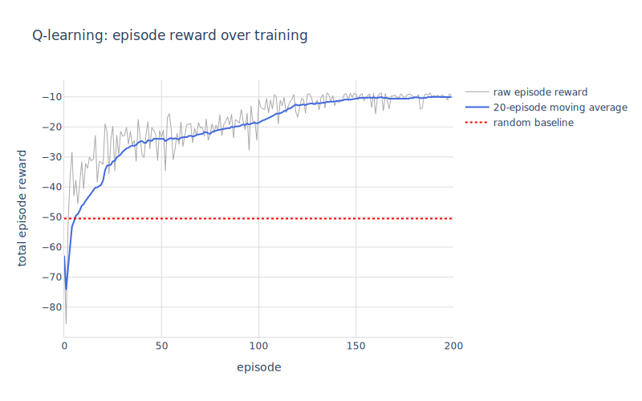
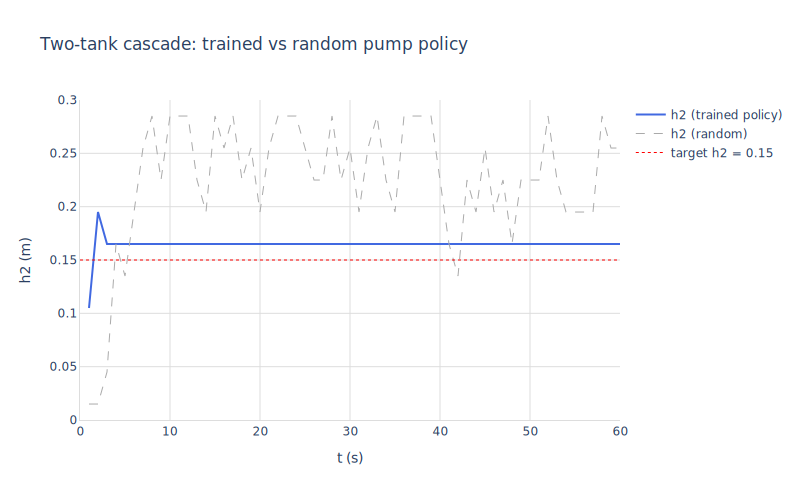
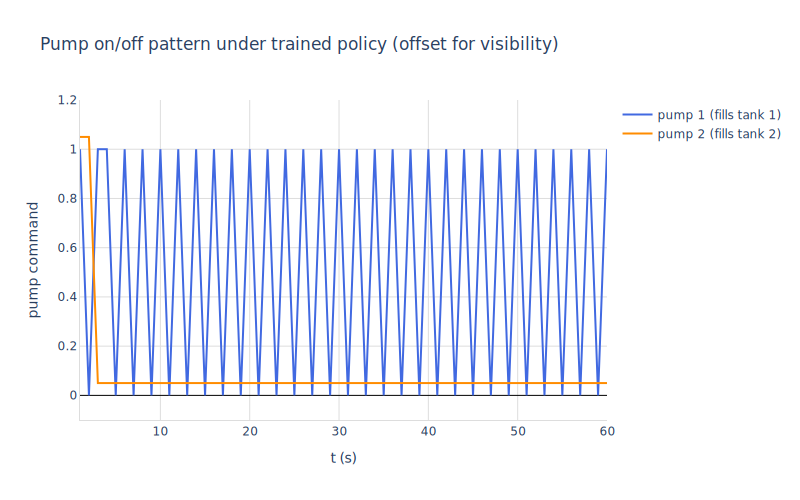

# 07 — Tabular Q-learning for a two-tank cascade

A process-control flavoured RL example. Two cascaded tanks: tank 1 drains into tank 2, tank 2 drains to atmosphere. Two pumps independently feed the tanks. Each pump is **on/off only** (no analogue control), so the action space is discrete: $(p_1, p_2) \in \{0, 1\}^2$, giving 4 actions per step.

The goal is to keep tank 2's level at $h_2 = 0.15$ m. A continuous PI controller can't drive on/off pumps directly; bang-bang controllers can, but require hand-tuning thresholds. We're going to let `np_qlearn` figure out the switching policy from rewards.

The interesting thing about this example is the **bridge**: `np_qlearn` wants discrete states and actions, but the plant is a continuous DAE in mochi. `mod_advance` glues the two: each Q-learning step converts the integer state to continuous tank levels, runs the plant for one second of control interval, then bins the result back to an integer.


```maxima
load("../../mochi.mac")$
load("numerics")$
load("numerics-sundials")$
load("numerics-learn")$
load("../../mochi-nonlinear.mac")$
load("ax-plots")$
```

## 1. The plant

$$\begin{aligned}
A_1 \dot{h}_1 &= p_1 \, q_{\max} - C_1 h_1 \\
A_2 \dot{h}_2 &= C_1 h_1 + p_2 \, q_{\max} - C_2 h_2
\end{aligned}$$

Linear orifice flow keeps the dynamics smooth (sqrt-of-negative drama avoided when discretisation rounds a level slightly below zero). With $A_1 = A_2 = 0.05$ m², $C_1 = C_2 = 0.02$ m²/s, $q_{\max} = 0.005$ m³/s, the steady-state level under one full pump is $h^* = q_{\max}/C = 0.25$ m.


```maxima
m : mod_load("../DoubleTankPumps.mo")$
mod_print(m)$
```

    Model:  DoubleTankPumps
      parameters:  [[A1,0.05],[A2,0.05],[C1,0.02],[C2,0.02],[q_max,0.005]]
      states:      [h1,h2]
      derivs:      [der_h1,der_h2]
      inputs:      [p1,p2]
      outputs:     [y1,y2]
      initial:     [[h1,0.05],[h2,0.05]]
      residuals:
         der_h1-(p1*q_max-C1*h1)/A1  = 0
         der_h2-(p2*q_max-C2*h2+C1*h1)/A2  = 0
         y1-h1  = 0
         y2-h2  = 0

## 2. Discretisation

For `np_qlearn`'s tabular Q-table, we need a finite state space. Both tank levels are bounded by physics ($h \in [0, 0.30]$ m for any reasonable pump policy), so we discretise each into 10 bins and combine into a single integer state $s \in \{0, \dots, 99\}$:


```maxima
n_bins : 10$
h_max : 0.30$
h2_target : 0.15$
dt : 1.0$  /* Control interval — one decision per second */

/* (h1, h2) → integer state in [0, 99]. */
encode(h_pair) := block(
  [b1 : floor(min(n_bins-1, max(0, h_pair[1] / h_max * n_bins))),
   b2 : floor(min(n_bins-1, max(0, h_pair[2] / h_max * n_bins)))],
  b1 * n_bins + b2)$

/* Inverse: integer state → bin centre as continuous (h1, h2). */
decode(s) := block(
  [b1 : floor(s / n_bins),
   b2 : mod(s, n_bins)],
  [(b1 + 0.5) * h_max / n_bins,
   (b2 + 0.5) * h_max / n_bins])$

/* Action: integer in [0, 3] → (p1, p2) ∈ {0,1}². */
action_to_pumps(a) := [floor(a / 2), mod(a, 2)]$

print("encode([0.05, 0.15]) =", encode([0.05, 0.15]))$
print("decode(34) =", decode(34))$
print("action_to_pumps(3) =", action_to_pumps(3))$
```

    encode([0.05, 0.15]) = 15
    decode(34) = [0.10500000000000001,0.13499999999999998]
    action_to_pumps(3) = [1,1]

## 3. The bridge: `mod_advance`

`mod_advance(m, x, u_value, dt)` is the one-step continuous-state simulator that bridges to numerics-learn's discrete-time RL APIs. It runs `mod_simulate_nonlinear` for exactly `dt` seconds with the input held constant, returns the final state. Wrap it in our own `step_fn(s, a)` that handles the discrete↔continuous translation, reward, and termination.

Rewards: large penalty for $h_2$ deviating from target, small penalty per pump-on (encourages parsimonious switching).


```maxima
step_fn(s, a) := block(
  [x_cont : decode(s),
   pumps : action_to_pumps(a),
   x_next, s_next, reward],
  /* One control interval of continuous integration */
  x_next : mod_advance(m, x_cont, pumps, dt,
                        ['rtol = 1e-8, 'atol = 1e-10]),
  s_next : encode(x_next),
  reward : -100 * (x_next[2] - h2_target)^2
           - 0.01 * (pumps[1] + pumps[2]),
  /* Episodes are fixed-length; never terminate early */
  [s_next, reward, false])$

/* Verify a single step: starting from empty, both pumps on for 1s. */
[sn, r, d] : step_fn(encode([0.0, 0.0]), 3)$
printf(true, "after step from empty (pumps=on,on): s=~d, r=~,4f, decoded=~a~%",
       sn, r, decode(sn))$
```

    after step from empty (pumps=on,on): s=33, r=-0.1653, decoded=[0.10500000000000001,0.10500000000000001]
    o135$$\mathbf{false}$$
    false

## 4. Random-policy baseline

Before training, compare against a random policy (uniformly sample one of the 4 actions per step). That's our "do nothing intelligent" baseline:


```maxima
np_seed(0)$

run_random(n_steps) := block(
  [s : encode([0.0, 0.0]),
   total_reward : 0,
   h2_traj : [],
   r, _],
  for k thru n_steps do block([a : random(4)],
    [s, r, _] : step_fn(s, a),
    total_reward : total_reward + r,
    h2_traj : endcons(decode(s)[2], h2_traj)),
  [total_reward, h2_traj])$

[r_random, h2_random] : run_random(60)$
printf(true, "random-policy reward (60 steps): ~,2f~%", r_random)$
```

    random-policy reward (60 steps): -63.85
    o141$$\mathbf{false}$$
    false

## 5. Train

`np_qlearn` runs the standard tabular Q-learning loop: ε-greedy action selection, Bellman update against the max-action of the next state, exponential ε decay across episodes. State and action are integers; the `step_fn` is the only thing that crosses into Maxima.


```maxima
np_seed(2)$

[Q, ep_rewards, ep_lengths] :
  np_qlearn(step_fn, n_bins * n_bins, 4,
            n_episodes=200, alpha=0.3, discount=0.95,
            epsilon=1.0, epsilon_decay=0.97, epsilon_min=0.05,
            max_steps=60,
            start_state=encode([0.0, 0.0]))$

printf(true, "trained Q shape: ~a~%", np_shape(Q))$
printf(true, "first/middle/last episode reward: ~,1f / ~,1f / ~,1f~%",
       np_ref(ep_rewards, 0),
       np_ref(ep_rewards, 99),
       np_ref(ep_rewards, 199))$
```

    trained Q shape: [100,4]
    o148first/middle/last episode reward: -77.5 / -2.6 / -3.2
    o148$$\mathbf{false}$$
    false


```maxima
/* Smooth episode rewards with a 20-episode moving average for legibility. */
rewards_list : np_to_list(ep_rewards)$
window : 20$
smooth_rewards : makelist(
  block([lo : max(1, k - window + 1)],
    apply("+", makelist(rewards_list[j], j, lo, k)) / (k - lo + 1)),
  k, 1, length(rewards_list))$

ax_draw2d(
  color="#aaa", line_width=1, name="raw episode reward",
  lines(makelist(k - 1, k, 1, length(rewards_list)), rewards_list),
  color="royalblue", line_width=2, name="20-episode moving average",
  lines(makelist(k - 1, k, 1, length(smooth_rewards)), smooth_rewards),
  color="red", dash="dot", name="random baseline",
  explicit(r_random, t, 0, 200),
  title="Q-learning: episode reward over training",
  xlabel="episode", ylabel="total episode reward",
  grid=true, showlegend=true)$
```


    

    


## 6. Replay the trained policy

Greedy action selection from the learned Q-table:


```maxima
/* argmax over Q[s, :].  Manual since Maxima doesn't ship one. */
greedy_action(s) := block(
  [best_a : 0, best_q : np_ref(Q, s, 0), q],
  for a : 1 thru 3 do (
    q : np_ref(Q, s, a),
    if q > best_q then (best_q : q, best_a : a)),
  best_a)$

run_greedy(n_steps) := block(
  [s : encode([0.0, 0.0]),
   total_reward : 0,
   h1_traj : [], h2_traj : [], action_traj : [],
   r, _, a],
  for k thru n_steps do (
    a : greedy_action(s),
    [s, r, _] : step_fn(s, a),
    total_reward : total_reward + r,
    h1_traj : endcons(decode(s)[1], h1_traj),
    h2_traj : endcons(decode(s)[2], h2_traj),
    action_traj : endcons(a, action_traj)),
  [total_reward, h1_traj, h2_traj, action_traj])$

[r_greedy, h1_g, h2_g, act_g] : run_greedy(60)$
printf(true, "greedy-policy reward (60 steps): ~,2f  (random was ~,2f)~%",
       r_greedy, r_random)$
```

    greedy-policy reward (60 steps): -0.73  (random was -63.85)
    o162$$\mathbf{false}$$
    false


```maxima
t_g : makelist(k * dt, k, 1, length(h2_g))$

ax_draw2d(
  color="royalblue", line_width=2, name="h2 (trained policy)",
  lines(t_g, h2_g),
  color="#aaaaaa", line_width=1, dash="dash", name="h2 (random)",
  lines(makelist(k * dt, k, 1, length(h2_random)), h2_random),
  color="red", dash="dot", name="target h2 = 0.15",
  explicit(0.15, t, 0, 60),
  title="Two-tank cascade: trained vs random pump policy",
  xlabel="t (s)", ylabel="h2 (m)",
  grid=true, showlegend=true)$
```


    

    


```maxima
/* Plot the action stream over time: which pump combo did the policy pick? */
p1_g : map(lambda([a], floor(a/2)), act_g)$
p2_g : map(lambda([a], mod(a,2)), act_g)$

ax_draw2d(
  color="royalblue", line_width=2, name="pump 1 (fills tank 1)",
  lines(t_g, p1_g),
  color="darkorange", line_width=2, name="pump 2 (fills tank 2)",
  lines(t_g, map(lambda([p], p + 0.05), p2_g)),
  title="Pump on/off pattern under trained policy (offset for visibility)",
  xlabel="t (s)", ylabel="pump command",
  yrange=[-0.1, 1.2],
  grid=true, showlegend=true)$
```


    

    


## What we got

The trained policy fills the tanks and parks $h_2$ near the 0.15 m target — using only on/off pumps, with the switching pattern discovered from rewards alone. The random baseline drifts around without converging.

Things worth noticing about the bridge:

- **`mod_advance` is the only thing that knows about the continuous plant.** Reward and termination are written in the user's `step_fn` from the continuous state vector. If you swap the plant (a different `.mo` file with different state/input names), only the encode/decode and `mod_advance` call change — the rest of the q-learning code stays identical.
- **Closed-loop policy in symbolic form was the easy mode.** For CEM (notebook 06) the policy was a symbolic Maxima expression in state and parameter symbols, compiled once per rollout. For tabular RL the policy is a lookup table; we don't compile anything. Bridge differs accordingly.
- **One control interval per qlearn step.** The continuous-time integration inside `mod_advance` happens at whatever rate CVODE picks (typically much finer than `dt`). The discretisation is *only* of the decision points, not the dynamics.

Limitations of the tabular approach showing here:

- 100 states × 4 actions = 400 Q-values to estimate. With 200 episodes × 60 steps = 12,000 transitions and ε decaying, coverage is patchy. Some states never get visited; their Q rows stay at zero. A finer grid (50×50) would need vastly more episodes.
- The reward design takes work. Penalising $h_2$ error alone gives a policy that thrashes pumps. The small per-pump-on penalty pushes the policy toward fewer activations. Real applications spend most of their development effort exactly here.

For continuous-state, continuous-action problems beyond tabular's reach, the next step is approximate Q-learning (e.g. neural Q functions) or policy-gradient methods — neither yet in `numerics-learn`, but the same `mod_advance` bridge would apply.
